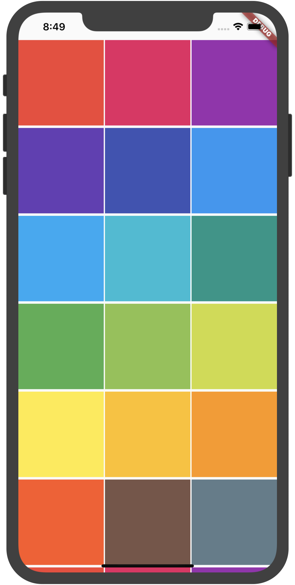
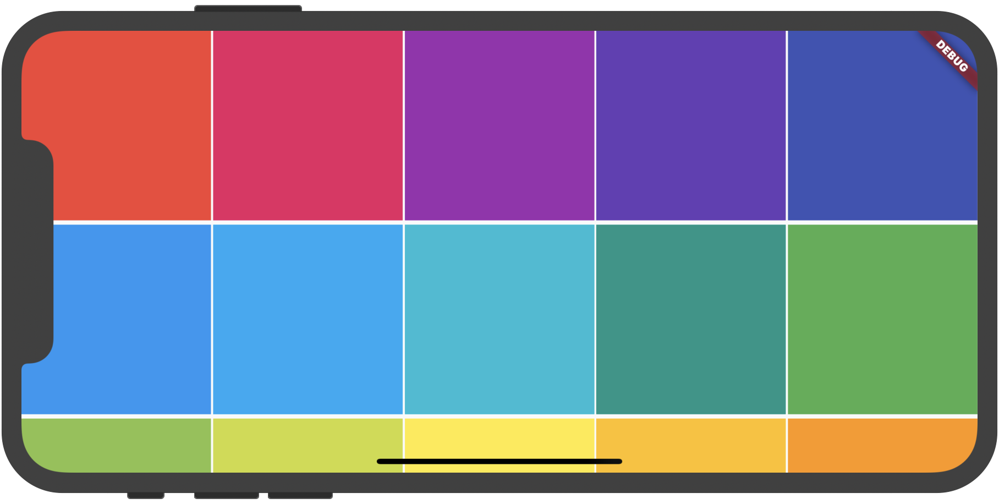

## OrientationBuilder

当手机的屏幕由横屏切换竖屏时，UI布局通常也会发生变化，可以通过`OrientationBuilder`来实现此效果，用法如下：

```dart
OrientationBuilder(
  builder: (BuildContext context, Orientation orientation) {
    int count = orientation == Orientation.portrait ? 3 : 5;
    return GridView.builder(
      gridDelegate: SliverGridDelegateWithFixedCrossAxisCount(
          crossAxisCount: count, crossAxisSpacing: 2, mainAxisSpacing: 4),
      itemBuilder: (context, index) {
        return Container(
          color: Colors.primaries[index % Colors.primaries.length],
        );
      },
      itemCount: 30,
    );
  },
)
```


竖屏效果：




横屏效果：

