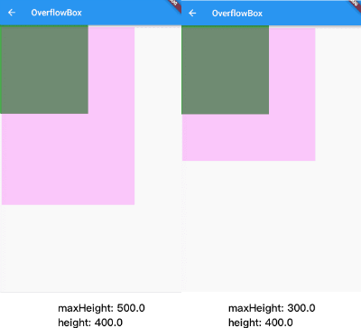

## OverflowBox

溢出父容器显示,允许child超出父容器的范围显示

```dart
OverflowBox({
    Key key,
    this.alignment = Alignment.center,//对齐方式。
    this.minWidth,//允许child的最小宽度。如果child宽度小于这个值，则按照最小宽度进行显示。
    this.maxWidth,//允许child的最大宽度。如果child宽度大于这个值，则按照最大宽度进行展示。
    this.minHeight,//允许child的最小高度。如果child高度小于这个值，则按照最小高度进行显示。
    this.maxHeight,//允许child的最大高度。如果child高度大于这个值，则按照最大高度进行展示。
    Widget child,
})
```

OverflowBox，允许child超出parent的范围显示，当然不用这个控件，也有很多种方式实现类似的效果。

- 当OverflowBox的最大尺寸大于child的时候，child可以完整显示，
- 当其小于child的时候，则以最大尺寸为基准，当然，这个尺寸都是可以突破父节点的。。
- 当最小以及最大宽高度，如果为null的时候，就取父节点的constraint代替。

案例

```dart
Container(
  color: Colors.green,
  width: 200.0,
  height: 200.0,
  padding: const EdgeInsets.all(5.0),
  child: OverflowBox(
    alignment: Alignment.topLeft,
    maxWidth: 300.0,
    maxHeight: 500.0,
    child: Container(
      color: Color(0x33FF00FF),
      width: 400.0,
      height: 400.0,
    ),
  ),
)

```




本文由[**Rock**]()提供。


