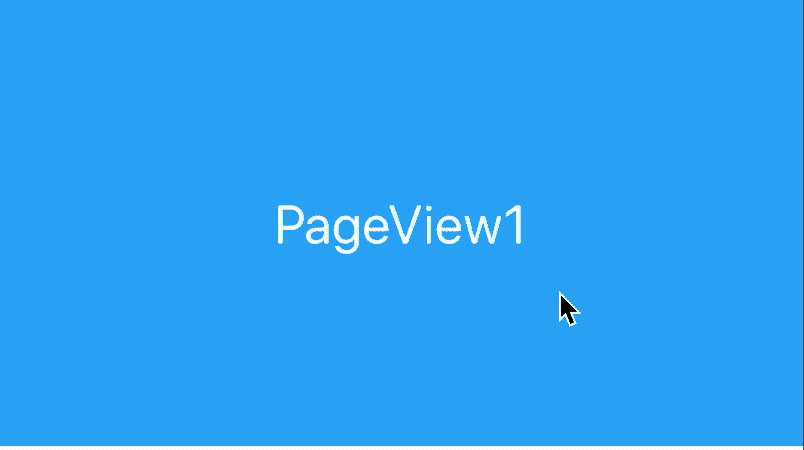
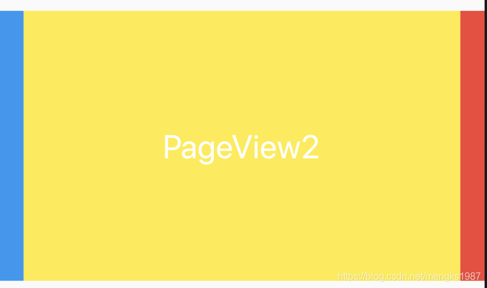
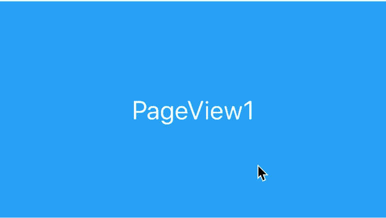
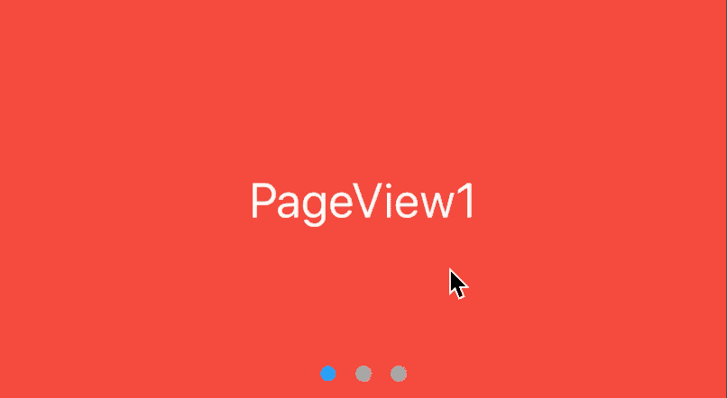

# PageView

PageView控件可以实现一个“图片轮播”的效果，PageView不仅可以水平滑动也可以垂直滑动，简单用法如下：

```
PageView(
	children: <Widget>[
		MyPage1(),    
		MyPage2(), 
		MyPage3(),    
    ],
)
```



PageView滚动方向默认是水平，可以设置其为垂直方向：
```
PageView(
	scrollDirection: Axis.vertical,
	...
)
```
PageView配合PageController可以实现非常酷炫的效果，控制每一个Page不占满，
```
PageView(
	controller: PageController(
		viewportFraction: 0.9，
	),
	...
)
```



PageController中属性`initialPage`表示当前加载第几页,默认第一页。

`onPageChanged`属性是页面发生变化时的回调，用法如下：
```
PageView(
	onPageChanged: (int index){
	},
	...
)
```

## 无限滚动

PageView滚动到最后时希望滚动到第一个页面，这样看起来PageView是无限滚动的：
```
List<Widget> pageList = [PageView1(), PageView2(), PageView3()];

PageView.builder(
	itemCount: 10000,
	itemBuilder: (context, index) {
		return pageList[index % (pageList.length)];
    },
)
```
巧妙的利用取余重复构建页面实现PageView无限滚动的效果：


## 实现指示器

指示器显示总数和当前位置，通过`onPageChanged`确定当前页数并更新指示器。

```
List<String> pageList = ['PageView1', 'PageView2', 'PageView3'];
  int _currentPageIndex = 0;

  _buildPageView() {
    return Center(
      child: Container(
        height: 230,
        child: Stack(
          children: <Widget>[
            PageView.builder(
              onPageChanged: (int index) {
                setState(() {
                  _currentPageIndex = index % (pageList.length);
                });
              },
              itemCount: 10000,
              itemBuilder: (context, index) {
                return _buildPageViewItem(pageList[index % (pageList.length)]);
              },
            ),
            Positioned(
              bottom: 10,
              left: 0,
              right: 0,
              child: Container(
                child: Row(
                  mainAxisAlignment: MainAxisAlignment.center,
                  children: List.generate(pageList.length, (i) {
                    return Container(
                      margin: EdgeInsets.symmetric(horizontal: 5),
                      width: 10,
                      height: 10,
                      decoration: BoxDecoration(
                          shape: BoxShape.circle,
                          color: _currentPageIndex == i
                              ? Colors.blue
                              : Colors.grey),
                    );
                  }).toList(),
                ),
              ),
            ),
          ],
        ),
      ),
    );
  }

  _buildPageViewItem(String txt, {Color color = Colors.red}) {
    return Container(
      color: color,
      alignment: Alignment.center,
      child: Text(
        txt,
        style: TextStyle(color: Colors.white, fontSize: 28),
      ),
    );
  }
```
效果如下：




## 切换动画
如此常见的切换效果显然不能体验我们独特的个性，我们需要更炫酷的方式，看下面的效果：


在滑出的时候当前页面逐渐缩小并居中，通过给PageController添加监听获取当前滑动的进度：
```
_pageController.addListener(() {
      setState(() {
        _currPageValue = _pageController.page;
      });
    });
```
通过当前的进度计算各个页面的缩放系数及平移系数，通过 判断当前构建的是哪个页面
```
if (index == _currPageValue.floor()) {
      //当前的item
      var currScale = 1 - (_currPageValue - index) * (1 - _scaleFactor);
     
    } else if (index == _currPageValue.floor() + 1) {
      //右边的item
      
    } else if (index == _currPageValue.floor() - 1) {
      //左边
      
    } else {
      //其他，不在屏幕显示的item
      
    }
```
通过对这几种类型的页面的缩放和平移达到我们想要的效果。

完整代码：

```
class ViewPage extends StatefulWidget {
  @override
  State<StatefulWidget> createState() => _ViewPageState();
}

class _ViewPageState extends State<ViewPage> {
  var imgList = [
    'https://ss1.bdstatic.com/70cFvXSh_Q1YnxGkpoWK1HF6hhy/it/u=2877516247,37083492&fm=26&gp=0.jpg',
    'https://timgsa.baidu.com/timg?image&quality=80&size=b9999_10000&sec=1582796218195&di=04ce93c4ac826e19067e71f916cec5d8&imgtype=0&src=http%3A%2F%2Fhbimg.b0.upaiyun.com%2F344fda8b47808261c946c81645bff489c008326f15140-koiNr3_fw658'
  ];
  PageController _pageController;

  var _currPageValue = 0.0;

  //缩放系数
  double _scaleFactor = .8;

  //view page height
  double _height = 230.0;

  @override
  void initState() {
    super.initState();
    _pageController = PageController(viewportFraction: 0.9);
    _pageController.addListener(() {
      setState(() {
        _currPageValue = _pageController.page;
      });
    });
  }

  @override
  void dispose() {
    super.dispose();
    _pageController.dispose();
  }
  @override
  Widget build(BuildContext context) {
    return Container(
        height: _height,
        child: PageView.builder(
          itemBuilder: (context, index) => _buildPageItem(index),
          itemCount: 10,
          controller: _pageController,
        ));
  }

  _buildPageItem(int index) {
    Matrix4 matrix4 = Matrix4.identity();
    if (index == _currPageValue.floor()) {
      //当前的item
      var currScale = 1 - (_currPageValue - index) * (1 - _scaleFactor);
      var currTrans = _height * (1 - currScale) / 2;

      matrix4 = Matrix4.diagonal3Values(1.0, currScale, 1.0)
        ..setTranslationRaw(0.0, currTrans, 0.0);
    } else if (index == _currPageValue.floor() + 1) {
      //右边的item
      var currScale =
          _scaleFactor + (_currPageValue - index + 1) * (1 - _scaleFactor);
      var currTrans = _height * (1 - currScale) / 2;

      matrix4 = Matrix4.diagonal3Values(1.0, currScale, 1.0)
        ..setTranslationRaw(0.0, currTrans, 0.0);
    } else if (index == _currPageValue.floor() - 1) {
      //左边
      var currScale = 1 - (_currPageValue - index) * (1 - _scaleFactor);
      var currTrans = _height * (1 - currScale) / 2;

      matrix4 = Matrix4.diagonal3Values(1.0, currScale, 1.0)
        ..setTranslationRaw(0.0, currTrans, 0.0);
    } else {
      //其他，不在屏幕显示的item
      matrix4 = Matrix4.diagonal3Values(1.0, _scaleFactor, 1.0)
        ..setTranslationRaw(0.0, _height * (1 - _scaleFactor) / 2, 0.0);
    }

    return Transform(
      transform: matrix4,
      child: Padding(
        padding: EdgeInsets.symmetric(horizontal: 10),
        child: Container(
          decoration: BoxDecoration(
            borderRadius: BorderRadius.circular(12),
            image: DecorationImage(
                image: NetworkImage(imgList[index % 2]), fit: BoxFit.fill),
          ),
        ),
      ),
    );
  }
}
```

### 推荐几款Github上带动画效果的PageView
- [Travel Cards](https://github.com/gskinnerTeam/flutter_vignettes/tree/master/vignettes/parallax_travel_cards_list)

- [Mindfullness Gooey Transition](https://github.com/gskinnerTeam/flutter_vignettes/tree/master/vignettes/gooey_edge)

- [page-transformer](https://github.com/roughike/page-transformer)

- [transformer_page_view](https://github.com/best-flutter/transformer_page_view)

- [smooth_page_indicator](https://github.com/Milad-Akarie/smooth_page_indicator)


