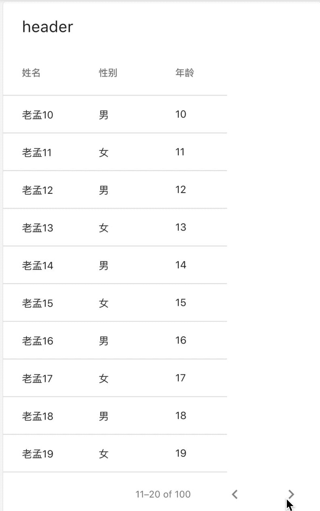
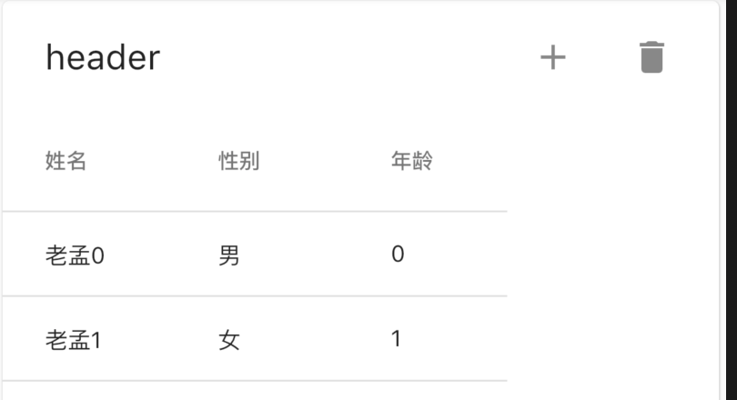
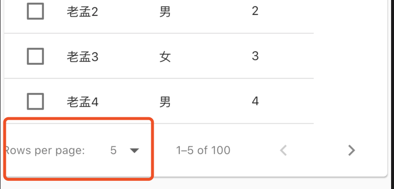
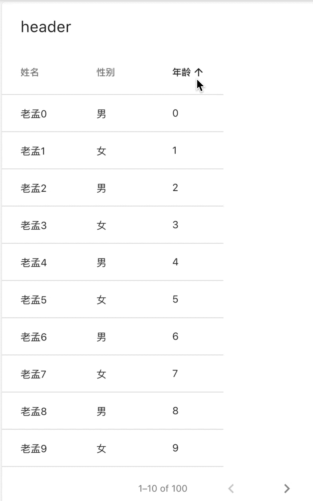
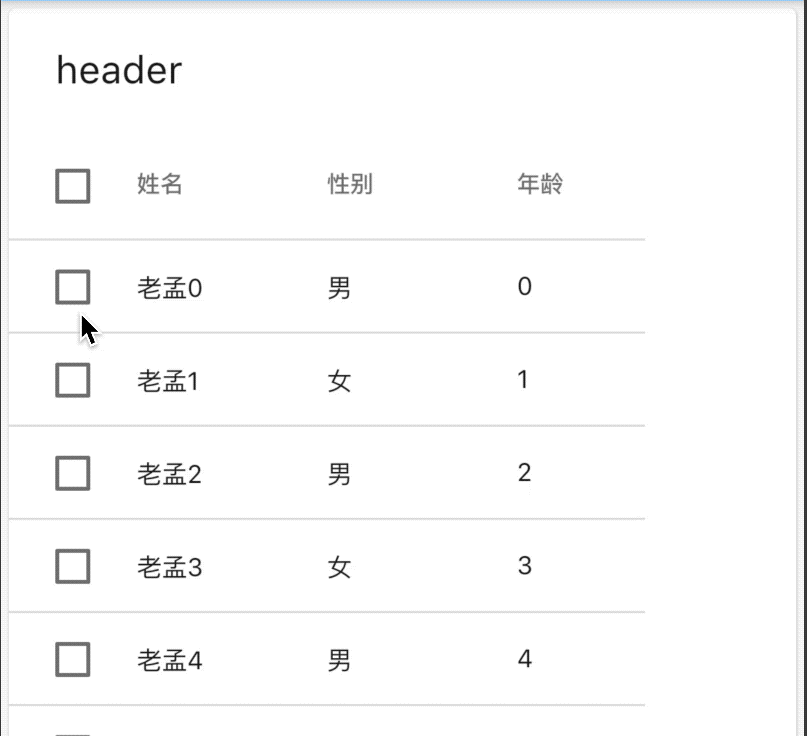

## PaginatedDataTable

PaginatedDataTable是一个带分页功能的DataTable，生成一批数据，项目中此一般通过服务器获取，定义model类：

```dart
class User {
  User(this.name, this.age, this.sex);

  final String name;
  final int age;
  final String sex;
}
```

生成数据：

```dart
List<User> _data = [];

@override
  void initState() {
    List.generate(100, (index) {
      _data.add(User('老孟$index', index % 50, index % 2 == 0 ? '男' : '女'));
    });
    super.initState();
  }
```

PaginatedDataTable的基础用法如下：

```dart
PaginatedDataTable(
  header: Text('header'),
  columns: [
    DataColumn(label: Text('姓名')),
    DataColumn(label: Text('性别')),
    DataColumn(label: Text('年龄')),
  ],
  source: MyDataTableSource(_data),
)
```

`header`表示表格顶部控件。

`columns`表示每一列的列头控件。

`source`表示数据源，需要继承DataTableSource，用法如下：

```dart
class MyDataTableSource extends DataTableSource {
  MyDataTableSource(this.data);

  final List<User> data;

  @override
  DataRow getRow(int index) {
    if (index >= data.length) {
      return null;
    }
    return DataRow.byIndex(
      index: index,
      cells: [
        DataCell(Text('${data[index].name}')),
        DataCell(Text('${data[index].sex}')),
        DataCell(Text('${data[index].age}')),
      ],
    );
  }

  @override
  int get selectedRowCount {
    return 0;
  }

  @override
  bool get isRowCountApproximate {
    return false;
  }

  @override
  int get rowCount {
    return data.length;
  }
}
```

效果如下：



`getRow`是根据index获取每一行的数据，通常使用DataRow.byIndex返回数据，cells表示每一个表格的数据，`cells`的数量需要与PaginatedDataTable中`columns`数量保持一致。

`selectedRowCount`是选中的行数，注意这里不是索引，是总共选中的行数。

`isRowCountApproximate`：如果`isRowCountApproximate`设置为true，行数将会无尽大，所以正常情况下`isRowCountApproximate`设置为false。

`rowCount`表示行数，如果`isRowCountApproximate`设置为true，此属性无效。

设置`actions`，显示在`header`的右端，用法如下：

```dart
PaginatedDataTable(
  header: Text('header'),
  actions: <Widget>[
    IconButton(icon: Icon(Icons.add),onPressed: (){},),
    IconButton(icon: Icon(Icons.delete),onPressed: (){},),
  ],
  ...
)
```

效果如下：



`rowsPerPage`表示每页显示的行数，默认10行，设置5行如下：

```dart
PaginatedDataTable(
  rowsPerPage: 5,
  ...
)
```

`onRowsPerPageChanged`不为null时，在左下角出现每页显示多少行数的选项，用法如下：

```dart
var _rowsPerPage = 5;
PaginatedDataTable(
  onRowsPerPageChanged: (v) {
    setState(() {
      _rowsPerPage = v;
    });
  },
  availableRowsPerPage: [5,10,15,16],
  rowsPerPage: _rowsPerPage,
  ...
)
```

效果如下：



点击出现`availableRowsPerPage`设置的数组，`onRowsPerPageChanged`为选择其中一项后回调，用于更新`rowsPerPage`属性。

显示的数据过多时，需要将PaginatedDataTable包裹在SingleChildScrollView中，滚动显示数据：

```dart
SingleChildScrollView(
  child: PaginatedDataTable()
)
```

`onPageChanged`是翻页时回调，返回当前页第一条数据的索引：

```dart
PaginatedDataTable(
  onPageChanged: (page){
    print('onPageChanged:$page');
  },
```

打印数据为：

```dart
flutter: onPageChanged:10
flutter: onPageChanged:20
flutter: onPageChanged:30
flutter: onPageChanged:40
```


## 排序

生序降序设置：

```dart
PaginatedDataTable(
  sortColumnIndex: 1,
  sortAscending: false,
  ...
)
```

效果如下：


生序降序的设置仅仅显示相应图标，数据并不会实际排序，对数据进行排序可以当用户点击表头时对数据按照本列数据进行排序，用法如下，

```dart
var _sortAscending = true;

_buildPaginatedDataTable() {
  return PaginatedDataTable(
    header: Text('header'),
    sortColumnIndex: 2,
    sortAscending: _sortAscending,
    columns: [
      DataColumn(label: Text('姓名')),
      DataColumn(label: Text('性别')),
      DataColumn(
          label: Text('年龄'),
          onSort: (index, sortAscending) {
            setState(() {
              _sortAscending = sortAscending;
              if (sortAscending) {
                _data.sort((a, b) => a.age.compareTo(b.age));
              } else {
                _data.sort((a, b) => b.age.compareTo(a.age));
              }
            });
          }),
    ],
    source: MyDataTableSource(_data),
  );
}
```

效果如下：




## 选中

可以在每一行的前面添加复选框，表示当前行是否选中，在User中添加是否选中属性，用法如下：

```dart
class User {
  User(this.name, this.age, this.sex, {this.selected = false});

  final String name;
  final int age;
  final String sex;
  bool selected;
}
```

添加勾选框：

```dart
@override
DataRow getRow(int index) {
  if (index >= data.length) {
    return null;
  }
  return DataRow.byIndex(
    index: index,
    selected: data[index].selected,
    onSelectChanged: (selected) {
      data[index].selected = selected;
      notifyListeners();
    },
    cells: [
      DataCell(
        Text('${data[index].name}'),
      ),
      DataCell(Text('${data[index].sex}')),
      DataCell(Text('${data[index].age}')),
    ],
  );
}
```

效果如下：



全选控制：

```dart
PaginatedDataTable(
  header: Text('header'),
  onSelectAll: (all) {
    setState(() {
      _data.forEach((f){
        f.selected = all;
      });
    });
  },
```


## 处理数据显示不全问题

当表格列比较多的时候，使用SingleChildScrollView包裹，显示不全时滚动显示，用法如下：

```dart
SingleChildScrollView(
  scrollDirection: Axis.horizontal,
  child: PaginatedDataTable()
)
```

效果如下：


