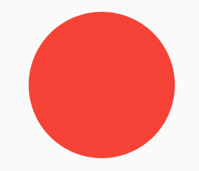

# PhysicalModel

代表物理层的控件，将其子控件裁剪为一个形状，可以设置阴影值及颜色，用法如下：

```dart
PhysicalModel(
  borderRadius: BorderRadius.circular(20),
  color: Colors.blue,
  elevation: 8,
  child: Container(
    height: 100,
    width: 100,
  ),
)
```

效果如下：


设置阴影值及颜色：

```dart
PhysicalModel(
  borderRadius: BorderRadius.circular(20),
  color: Colors.blue,
  elevation: 18,
  shadowColor: Colors.red,
  child: Container(
    height: 100,
    width: 100,
  ),
)
```

效果如下：


# PhysicalShape

PhysicalShape 与PhysicalModel类似,其提供阴影

```
PhysicalShape({
    Key key,
    @required this.clipper,设置边缘剪切形状
    this.clipBehavior = Clip.none,
    this.elevation = 0.0,设置垂直高度
    @required this.color,背景颜色
    this.shadowColor = const Color(0xFF000000),影子颜色
    Widget child,
  })
```

PhysicalShape和PhysicalModel类似，只不过可以自定义path，下面裁剪为圆形：

```dart
PhysicalShape(
  color: Colors.red,
  clipper: ShapeBorderClipper(shape: CircleBorder()),
  child: Container(
    height: 150,
    width: 150,
  ),
)
```



本文由[**Rock**]()提供。