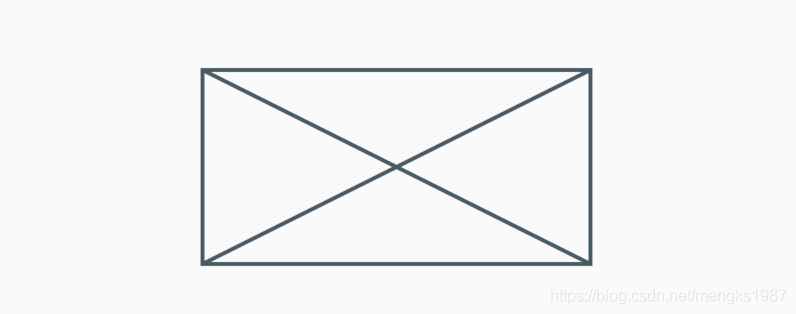
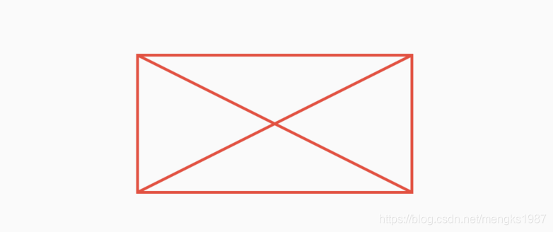
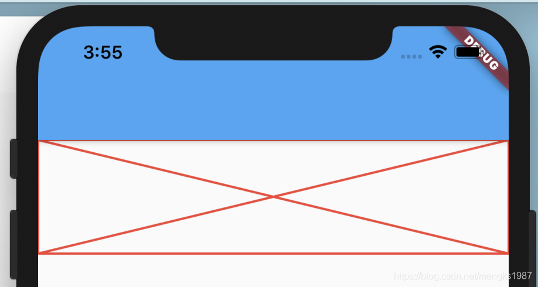

# Placeholder

Placeholder是一个占位符控件，用于当没有准备好构建组件时，可以使用Placeholder进行占位。

基础用法如下：

```dart
Container(
  height: 100,
  width: 200,
  child: Placeholder(),
)
```

Placeholder默认充满父组件。效果如下：



对其颜色、线条粗细进行设置如下：

```dart
Placeholder(
  color: Colors.red,
  strokeWidth: 2,
)
```

效果如下：



当Placeholder处在一个无限空间的时候，可以通过`fallbackWidth`和`fallbackHeight`设置其宽高，ListView就是一个典型的无限空间的控件。看下面的设置：

```dart
ListView(
  children: <Widget>[
    Placeholder(
      fallbackHeight: 100,
      fallbackWidth: 100,
    )
  ],
)
```

你以为会显示一个100x100的Placeholder？No，记住`fallbackWidth`和`fallbackHeight`是在无限空间的情况下才生效的，比如上面的ListView是垂直滚动，也就是高是无限的，而宽不是，宽充满父控件，所以效果如下：

