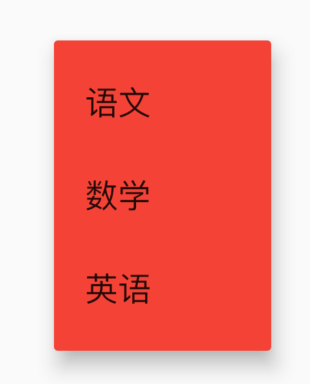

# PopupMenuTheme

用于**PopupMenu**的样式。

```dart
PopupMenuTheme(
  data: PopupMenuThemeData(
    color: Colors.red
  ),
  child: PopupMenuButton<String>(
    itemBuilder: (context) {
      return <PopupMenuEntry<String>>[
        PopupMenuItem<String>(
          value: '语文',
          child: Text('语文'),
        ),
        PopupMenuItem<String>(
          value: '数学',
          child: Text('数学'),
        ),
        PopupMenuItem<String>(
          value: '英语',
          child: Text('英语'),
        ),
      ];
    },
  ),
)
```




## PopupMenuThemeData

样式说明：

```dart
const PopupMenuThemeData({
  this.color,//背景颜色
  this.shape,//形状
  this.elevation,//阴影
  this.textStyle,//文本样式
})
```

