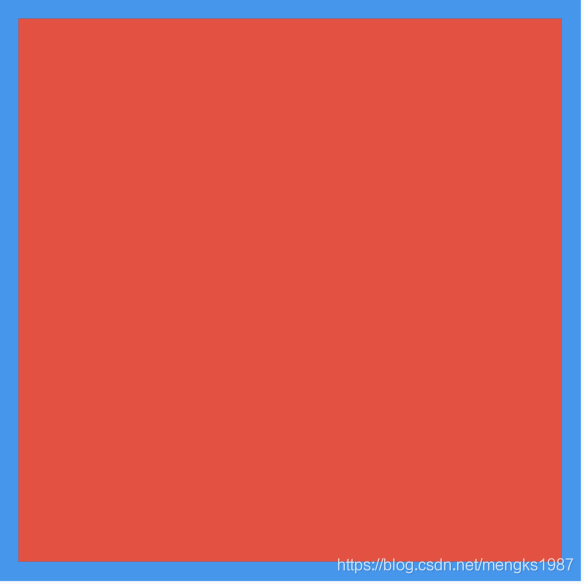

# Positioned

Positioned用于定位Stack子组件，Positioned必须是Stack的子组件，基本用法如下：

```dart
Stack(
  children: <Widget>[
    Positioned(
      left: 10,
      right: 10,
      top: 10,
      bottom: 10,
      child: Container(color: Colors.red),
    ),
  ],
)
```

效果如下：



相关说明：

- 提供`top`、`bottom`、`left`、`right`四种定位属性，分别表示距离上下左右的距离。
- 只能用于Stack组件中。
- `left`、`right`和`width`3个参数只能设置其中2个，因为设置了其中2个，第三个已经确定了，同理`top`、`bottom`和`height`也只能设置其中2个。

Positioned提供便捷的构建方式，比如`Positioned.fromRect`、`Positioned.fill`等，这些便捷的构建方式万变不离其宗，只不过换了一种方式设置`top`、`bottom`、`left`、`right`四种定位属性。


