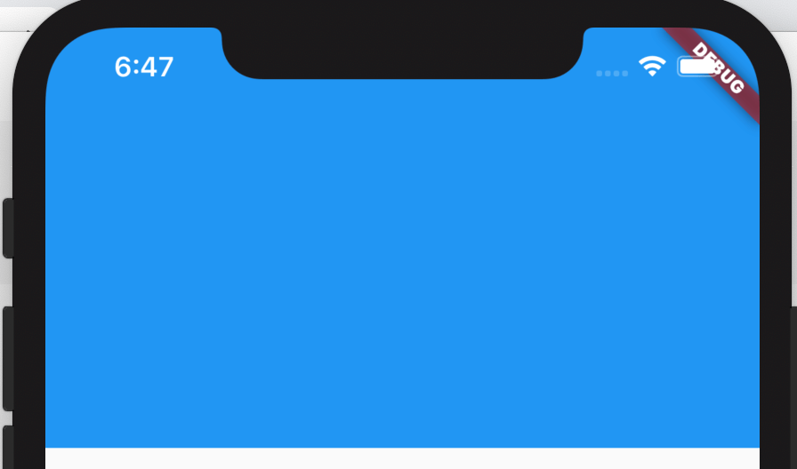
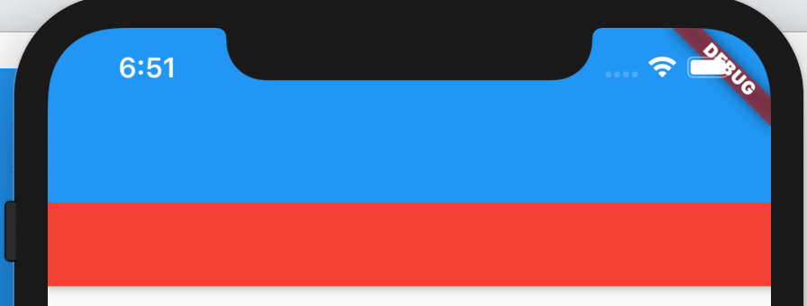

# PreferredSize

此控件不对其子控件施加任何约束，并且不以任何方式影响孩子的布局。

此控件对自定义`AppBar.bottom`和`AppBar`非常有用。

自定义`AppBar`，也可以直接设置`AppBar`的高度（PreferredSize子控件为AppBar）

```dart
Scaffold(
        appBar: PreferredSize(
          preferredSize: Size.fromHeight(200),
          child: Container(
            color: Colors.blue,
          ),
        ),
        body: Test1(),
      )
```




`AppBar.bottom`通常是TabBar等，通过PreferredSize可设置为任意组件：

```dart
Scaffold(
  appBar: AppBar(
    bottom: PreferredSize(
      preferredSize: Size.fromHeight(48),
      child: Container(
        height: 48,
        color: Colors.red,
      ),
    ),
  ),
  body: Test1(),
)
```

