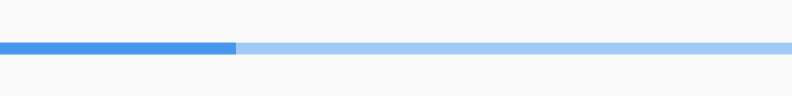
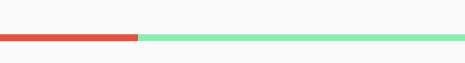
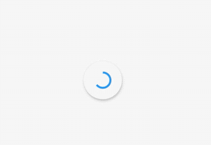

## LinearProgressIndicator

水平进度指示器，基本用法如下：

```dart
LinearProgressIndicator()
```

效果如下：


设置具体进度值：

```dart
LinearProgressIndicator(
  value: 0.3,
)
```

`value`的值范围是0-1，效果如下：



设置背景颜色及进度值：

```dart
LinearProgressIndicator(
  value: 0.3,
  backgroundColor: Colors.greenAccent,
  valueColor: AlwaysStoppedAnimation<Color>(Colors.red),
)
```

效果如下：




## CircularProgressIndicator

CircularProgressIndicator 是圆形进度条，和LinearProgressIndicator用法一样：

```dart
CircularProgressIndicator()
```

效果如下：


设置进度值及颜色值：

```dart
CircularProgressIndicator(
  value: 0.3,
  backgroundColor: Colors.greenAccent,
  valueColor: AlwaysStoppedAnimation<Color>(Colors.red),
)
```

效果如下：


## CupertinoActivityIndicator


CupertinoActivityIndicator是ios风格的指示器，CupertinoActivityIndicator不能设置进度，只能一直转“菊花”。

```dart
CupertinoActivityIndicator(
  radius: 10,
)
```

`radius`参数是半径，值越大，控件越大。

效果如下：


## RefreshProgressIndicator

RefreshProgressIndicator 是刷新指示器，通常用于下拉刷新，基本用法如下：

```dart
RefreshProgressIndicator()
```

效果如下：



设置宽度及颜色：

```dart
RefreshProgressIndicator(
  backgroundColor: Colors.greenAccent,
  valueColor: AlwaysStoppedAnimation<Color>(Colors.red),
  strokeWidth: 5.0,
)
```

效果如下：


