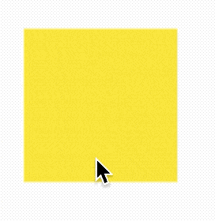

# RawGestureDetector

检测给定手势的控件，对于普通的手势，通常使用**GestureRecognizer**，**RawGestureDetector**主要用于开发我们自己的手势。

用法如下：

```dart
String _last = '';

RawGestureDetector(
  gestures: <Type, GestureRecognizerFactory>{
    TapGestureRecognizer:
        GestureRecognizerFactoryWithHandlers<TapGestureRecognizer>(
      () => TapGestureRecognizer(),
      (TapGestureRecognizer instance) {
        instance
          ..onTapDown = (TapDownDetails details) {
            setState(() {
              _last = 'down';
            });
          }
          ..onTapUp = (TapUpDetails details) {
            setState(() {
              _last = 'up';
            });
          }
          ..onTap = () {
            setState(() {
              _last = 'tap';
            });
          }
          ..onTapCancel = () {
            setState(() {
              _last = 'cancel';
            });
          };
      },
    ),
  },
  child: Container(
      width: 100.0,
      height: 100.0,
      color: Colors.yellow,
      alignment: Alignment.center,
      child: Text(_last)),
)
```



