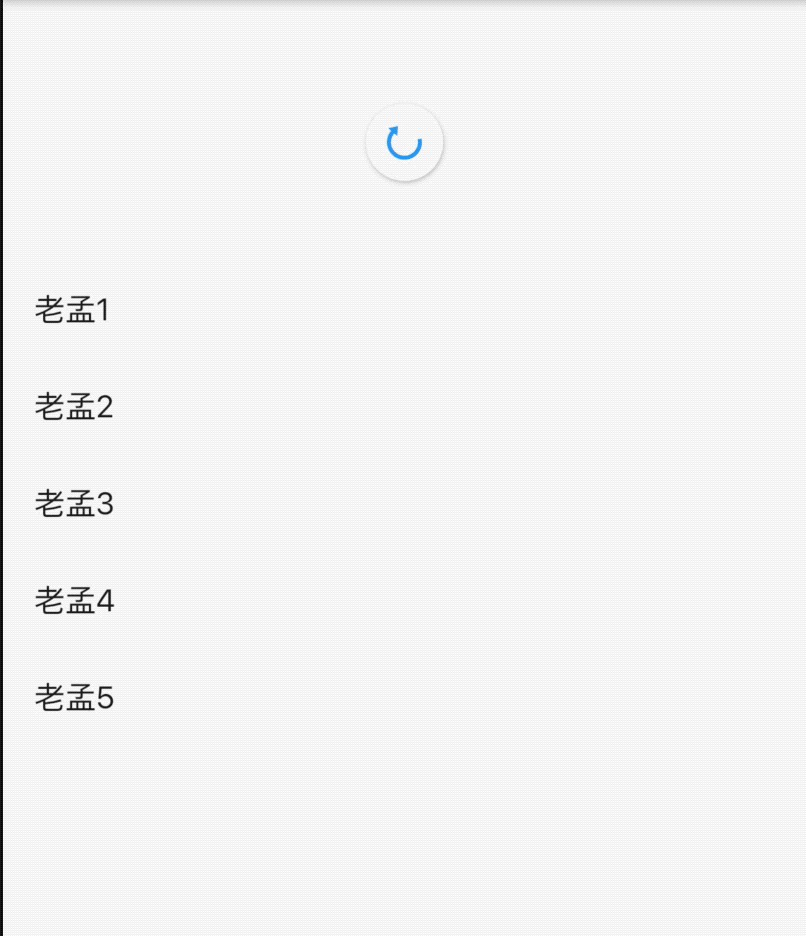
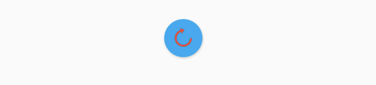
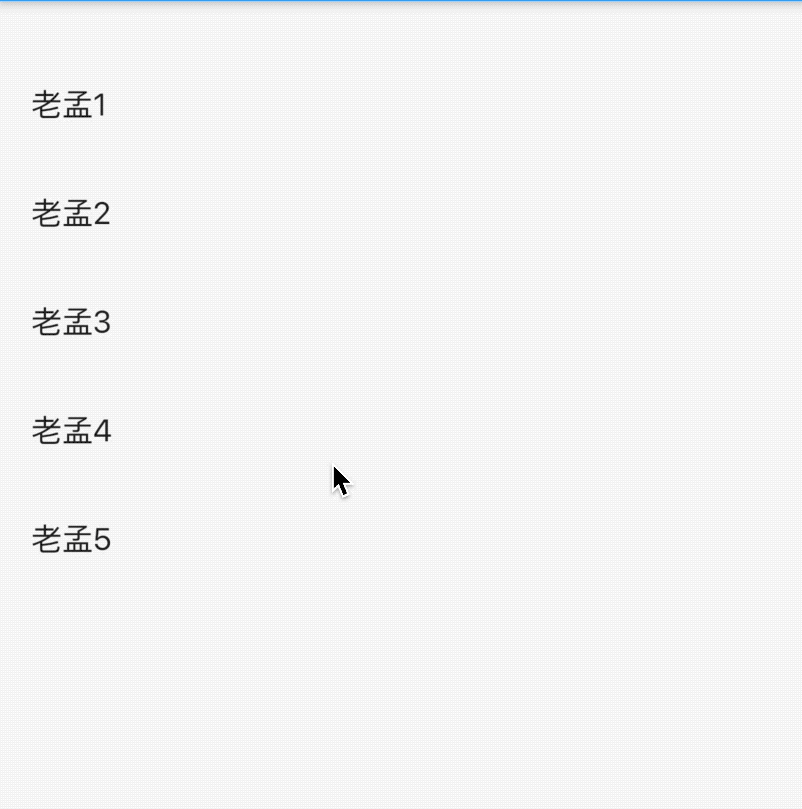

##  RefreshIndicator

RefreshIndicator是Material风格的下拉刷新组件。

基本用法如下：

```dart
var _list = [1, 2, 3, 4, 5];

RefreshIndicator(
      onRefresh: () async {
        setState(() {
          _list.add(_list.length + 1);
        });
      },
      child: ListView.builder(
        itemBuilder: (context, index) {
          return ListTile(
            title: Text('老孟${_list[index]}'),
          );
        },
        itemExtent: 50,
        itemCount: _list.length,
      ),
    )
```

RefreshIndicator和ListView组合 下拉刷新功能，效果如下：




设置指示器到顶部或者底部到距离：

```dart
RefreshIndicator(
  displacement: 10,
  ...
)
```

设置指示器的前置颜色和背景颜色：

```dart
RefreshIndicator(
  color: Colors.red,
  backgroundColor: Colors.lightBlue,
    ...
)
```

效果如下：




## CupertinoSliverRefreshControl

CupertinoSliverRefreshControl 是ios风格的下拉刷新控件。

基本用法：

```dart
var _list = [1, 2, 3, 4, 5];
CustomScrollView(
  slivers: <Widget>[
    CupertinoSliverRefreshControl(
      onRefresh: () async {
        setState(() {
          _list.add(_list.length + 1);
        });
      },
    ),
    SliverList(
      delegate: SliverChildBuilderDelegate((content, index) {
        return ListTile(
          title: Text('老孟${_list[index]}'),
        );
      }, childCount: _list.length),
    )
  ],
)
```

CupertinoSliverRefreshControl的用法和RefreshIndicator不同，CupertinoSliverRefreshControl需要放在CustomScrollView中。

效果如下：



