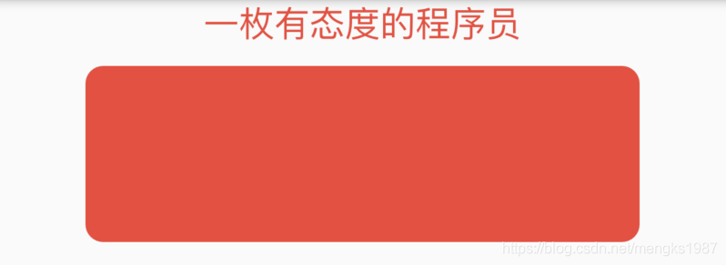
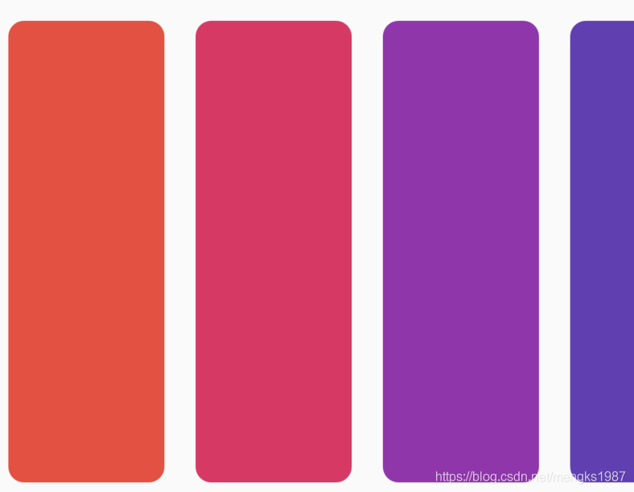

# ReorderableListView

ReorderableListView是通过长按拖动某一项到另一个位置来重新排序的列表组件。

ReorderableListView需要设置`children`和`onReorder`属性，`children`是子控件，`onReorder`是拖动完成后的回调，用法如下：

```dart
List<String> items = List.generate(20, (int i) => '$i');
ReorderableListView(
  children: <Widget>[
    for (String item in items)
      Container(
        key: ValueKey(item),
        height: 100,
        margin: EdgeInsets.symmetric(horizontal: 50, vertical: 10),
        decoration: BoxDecoration(
            color:
                Colors.primaries[int.parse(item) % Colors.primaries.length],
            borderRadius: BorderRadius.circular(10)),
      )
  ],
  onReorder: (int oldIndex, int newIndex) {
    if (oldIndex < newIndex) {
      newIndex -= 1;
    }
    var child = items.removeAt(oldIndex);
    items.insert(newIndex, child);
    setState(() {});
  },
)
```

ReorderableListView的每个子控件必须设置唯一的key，ReorderableListView没有“懒加载”模式，需要一次构建所有的子组件，所以ReorderableListView并不适合加载大量数据的列表，它适用于有限集合且需要排序的情况，比如手机系统里面设置语言的功能，通过拖动对语言排序。

`onReorder`是拖动完成的回调，第一个参数是旧的数据索引，第二个参数是拖动到位置的索引，回调里面需要对数据进行排序并通过`setState`刷新数据。

效果如下：


`header`参数显示在列表的顶部，用法如下：

```dart
ReorderableListView(
  header: Text(
    '一枚有态度的程序员',
    style: TextStyle(color: Colors.red,fontSize: 20),
  )
  ...
)
```

效果如下：



`reverse`参数设置为true且ReorderableListView的滚动方向为垂直时，滚动条直接滑动到底部，如果是水平方向则滚动条直接滑动到右边，默认为false，用法如下：

```dart
ReorderableListView(
  reverse: true,
  ...
)
```

`scrollDirection`参数表示滚动到方向，默认为垂直，设置为水平方向如下：

```dart
ReorderableListView(
  scrollDirection: Axis.horizontal,
  ...
)
```

由于改为水平滚动，所以子控件的宽度要设置，否则会出现没有列表。

效果如下：

