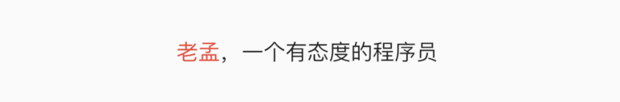

# RichText

## 基础用法

应用程序离不开文字的展示，因此文字的排版非常重要，通常情况下`Text`组件可以完成绝大多数需求，它可以显示不同大小的文字、字体、颜色等，如果想在一句话或者一段文字里面显示不同样式的文字，`Text`组件无法满足我们的需求，这个时候需要使用`RichText `。

```
RichText(
      text: TextSpan(
          style: DefaultTextStyle.of(context).style,
          children: <InlineSpan>[
            TextSpan(text: '老孟',style: TextStyle(color: Colors.red)),
            TextSpan(text: '，'),
            TextSpan(text: '一个有态度的程序员'),
          ]),
    )
```

`RichText` 组件的`text`属性是TextSpan，TextSpan中的`style `样式需要设置属性，不设置无法显示文字，一般设置应用程序的默认字体样式`DefaultTextStyle.of(context).style`，在子组件其中一个TextSpan设置不同的样式，比如上面的代码中设置“老孟”文字为红色，效果如下：



当文字有较多行时，可以设置其对齐方式：
```
RichText(
	textAlign: TextAlign.end,
	...
)
```
`TextAlign.start`的效果：


`TextAlign.center`的效果：


`TextAlign.end`的效果：


## 手势交互

当然我们也可以设置其他样式，比如大小、斜体等，甚至我们还可以添加点击效果，
```
RichText(
      text: TextSpan(
          style: DefaultTextStyle.of(context).style,
          children: <InlineSpan>[
            TextSpan(text: '登陆即视为同意'),
            TextSpan(
              text: '《xxx服务协议》',
              style: TextStyle(color: Colors.red),
              recognizer: TapGestureRecognizer()..onTap = () {
                
              },
            ),
          ]),
    )
```
`recognizer `属性指定手势交互，类型是`GestureRecognizer`,`GestureRecognizer`是抽象类，一般使用其子类`TapGestureRecognizer`实现点击交互。


