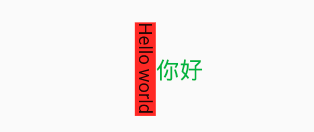

## RotatedBox

旋转盒子

```dart
RotatedBox({
    Key key,
    @required this.quarterTurns,//旋转的次数，每次旋转的度数只能是90度的整数倍
    Widget child,
})
```

RotatedBox和Transform.rotate功能相似，它们都可以对子组件进行旋转变换，但是有一点不同：RotatedBox的变换是在layout阶段，会影响子组件的位置和大小

案例

```dart
Row(
  mainAxisAlignment: MainAxisAlignment.center,
  children: <Widget>[
    DecoratedBox(
      decoration: BoxDecoration(color: Colors.red),
      //将Transform.rotate换成RotatedBox  
      child: RotatedBox(
        quarterTurns: 1, //旋转90度(1/4圈)
        child: Text("Hello world"),
      ),
    ),
    Text("你好", style: TextStyle(color: Colors.green, fontSize: 18.0),)
  ],
),

```




由于`RotatedBox`是作用于layout阶段，所以子组件会旋转90度（而不只是绘制的内容），`decoration`会作用到子组件所占用的实际空间上，所以最终就是上图的效果


本文由[**Rock**]()提供。