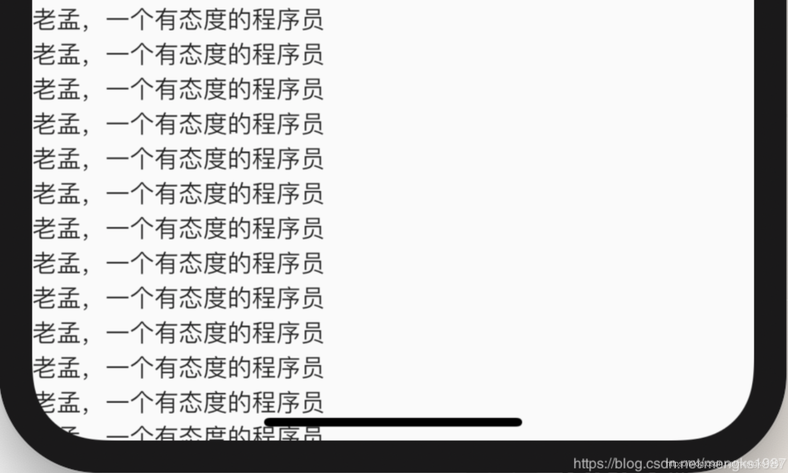
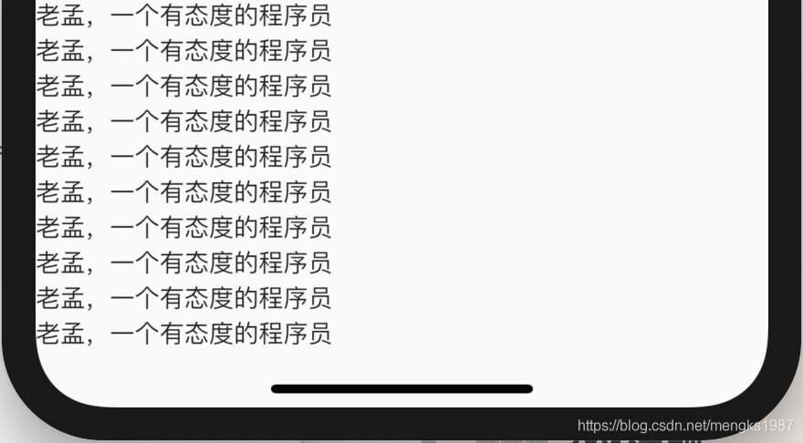
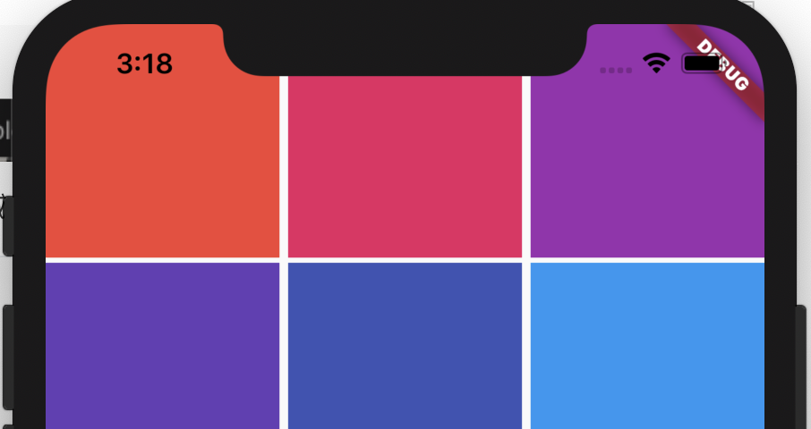
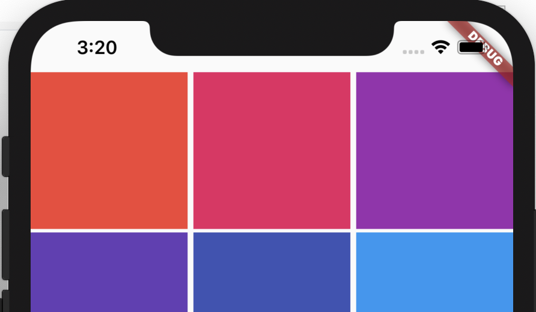

## SafeArea

现如今的手机已经不能提供给应用程序规整的矩形界面了，一些带圆角或者是刘海屏让应用程序的布局更加复杂，甚至是需要单独适配，这对开发者来来太糟糕了。


因此SafeArea控件应用而生，SafeArea通过`MediaQuery`检测屏幕的尺寸使应用程序的大小与屏幕适配。

创建一个铺满全屏的ListView，并显示数据，代码如下：
```
ListView(
      children: List.generate(100, (i) => Text('老孟，一个有态度的程序员')),
    )
```
效果如图：



底部的数据明显被遮挡了，想要解决这个问题只需将ListView包裹在SafeArea中即可，代码如下：
```
SafeArea(
      child: ListView(
        children: List.generate(100, (i) => Text('老孟，一个有态度的程序员')),
      ),
    )
```
效果如图：


我们甚至可以指定显示区域，默认情况下上下左右都是指定区域，如下代码去掉左侧区域：
```
SafeArea(
	left: false,
    child: ListView(),
)
```


## SliverSafeArea

SliverSafeArea的功能和SafeArea是一样的，区别就是SliverSafeArea用于Sliver控件，比如下面的用法：

```dart
CustomScrollView(
  slivers: <Widget>[
    SliverGrid(
      gridDelegate: SliverGridDelegateWithFixedCrossAxisCount(
          crossAxisCount: 3, crossAxisSpacing: 5, mainAxisSpacing: 3),
      delegate: SliverChildBuilderDelegate((BuildContext context, int index) {
        return Container(
          color: Colors.primaries[index % Colors.primaries.length],
        );
      }, childCount: 20),
    )
  ],
)
```

```dart

```

在刘海屏上的效果：




顶部有一部分被刘海屏遮挡住了，解决此问题的方法是将SliverGrid包裹在SliverSafeArea中：

```dart
CustomScrollView(
  slivers: <Widget>[
    SliverSafeArea(
      sliver: SliverGrid(
        gridDelegate: SliverGridDelegateWithFixedCrossAxisCount(
            crossAxisCount: 3, crossAxisSpacing: 5, mainAxisSpacing: 3),
        delegate: SliverChildBuilderDelegate((BuildContext context, int index) {
          return Container(
            color: Colors.primaries[index % Colors.primaries.length],
          );
        }, childCount: 20),
      ),
    )
  ],
)
```

效果：

