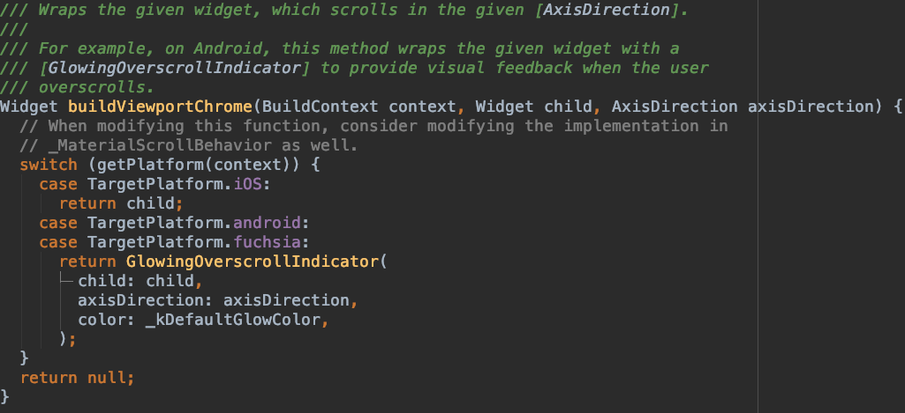

# ScrollConfiguration

ScrollConfiguration 用于控制子控件的滚动行为。通常我们不会直接使用此控件。


用法如下：

```dart
ScrollConfiguration(
  behavior: ScrollBehavior(),
  child: ListView.separated(
    itemBuilder: (BuildContext context, int index) {
      return Text('Item$index');
    },
    separatorBuilder: (BuildContext context, int index){
      return Divider();
    },
    itemCount: 50,
  ),
)
```

在ios上效果如下：


效果由ScrollBehavior控制，看下ScrollBehavior的源码：



在ios上直接返回子控件，在android上返回GlowingOverscrollIndicator。

