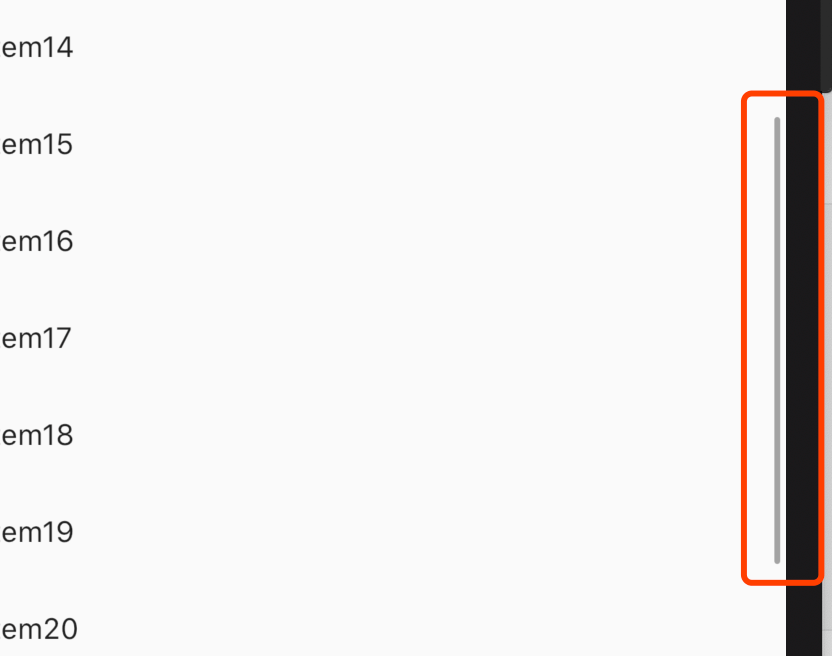

# Scrollbar

Material风格的滚动条，比如ListView等可滚动控件默认情况下是没有滚动指示器的，如果想给其加滚动条，用法如下：

```dart
Scrollbar(
  child: ListView.builder(
    itemBuilder: (BuildContext context, int index) {
      return Text('Item$index');
    },
    itemExtent: 50,
    itemCount: 50,
  ),
)
```




## CupertinoScrollbar

CupertinoScrollbar是iOS风格的滚动条，用法和Scrollbar一样。