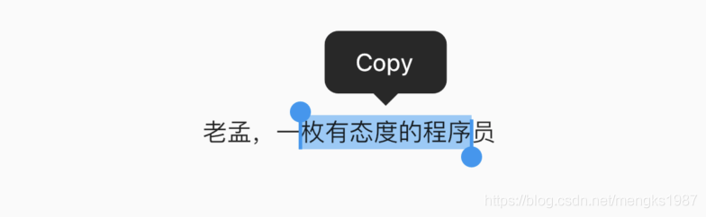
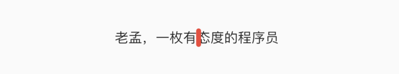

# SelectableText

想象一下，应用程序中的文本可以被选中，并可以复制、剪切是不是很酷炫，SelectableText控件就提供了这样的功能，如下：

```dart
SelectableText(
  '老孟，一枚有态度的程序员'
)
```

选中效果：



设置光标的相关参数，光标默认不显示，`showCursor`为true显示光标，用法如下：

```dart
SelectableText(
  '老孟，一枚有态度的程序员',

  showCursor: true,
  autofocus: true,
  cursorColor: Colors.red,
  cursorRadius: Radius.circular(10),
  cursorWidth: 5,

)
```

效果如下：



默认情况下选择的操作有Copy和SelectAll，虽然ToolbarOptions还可以设置`cut`和`paste`，但这2个属性对EditableText组件才起作用，用法如下：

```dart
SelectableText(
  '老孟，一枚有态度的程序员',
  toolbarOptions: ToolbarOptions(
    copy: true,
    selectAll: true
  ),
)
```

我们还可以添加`onTap`响应单击手势，用法如下：

```dart
SelectableText(
  '老孟，一枚有态度的程序员',
  onTap:(){}
)
```

当文字超过文本框的时候，可向下滚动显示更多的文本，用法如下：

```dart
Container(
  height: 100,
  width: 250,
  child: SelectableText(
    '老孟，一枚有态度的程序员。老孟，一枚有态度的程序员。'
    '老孟，一枚有态度的程序员。老孟，一枚有态度的程序员。'
    '老孟，一枚有态度的程序员。老孟，一枚有态度的程序员。'
    '老孟，一枚有态度的程序员。老孟，一枚有态度的程序员。',
    scrollPhysics: ClampingScrollPhysics(),
  ),
)
```

效果如下：


通过`SelectableText.rich`命名构造函数可以构建更多样式的文本，`SelectableText.rich`的用法和`Text.rich`或者[RichText](https://blog.csdn.net/mengks1987/article/details/104592347)用法一样，SelectableText还有一些关于文本样式的参数，比如`style`、`textAlign`等，这些参数的用法和[Text](https://blog.csdn.net/mengks1987/article/details/84833224)一样，这里就不在单独介绍。

