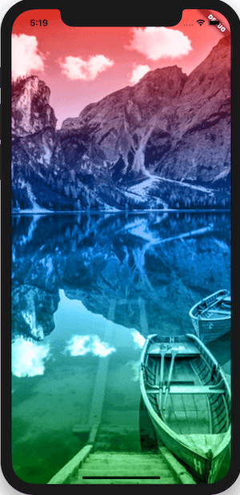
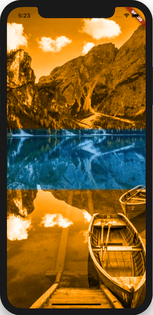
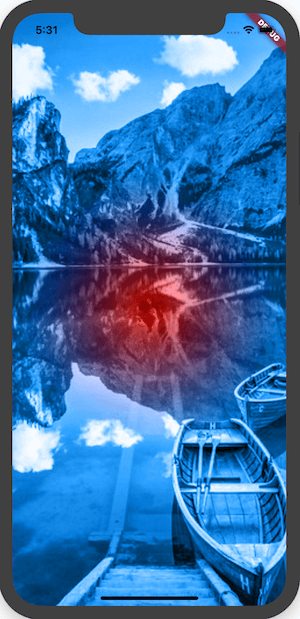
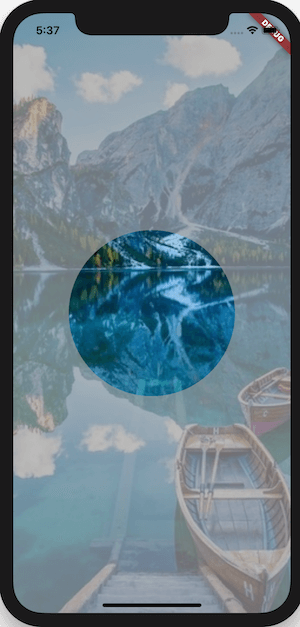
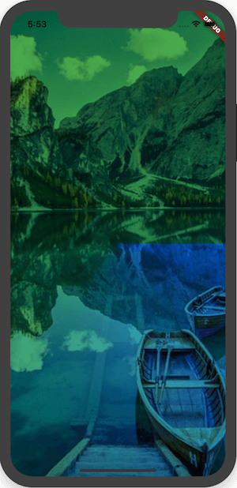
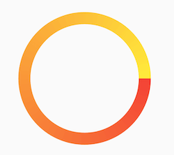

# ShaderMask


Flutter 中渐变有三种：

-  LinearGradient：线性渐变
-  RadialGradient：放射状渐变
-  SweepGradient：扇形渐变


看下原图，下面的渐变都是在此图基础上完成。


### LinearGradient


给一张图片添加从上到下的线性渐变：

```dart
ShaderMask(
  shaderCallback: (Rect bounds) {
    return LinearGradient(
      begin: Alignment.topCenter,
      end: Alignment.bottomCenter,
      colors: [Colors.red,Colors.blue,Colors.green],
    ).createShader(bounds);
  },
  blendMode: BlendMode.color,
  child: Image.asset(
    'assets/images/b.jpg',
    fit: BoxFit.cover,
  ),
)
```




`begin`  和 `end` 表示渐变的方向，上面设置的方向是从顶部中间到底部中间。

`color` 表示渐变的颜色。


设置各个渐变色的结束点：

```dart
Color color = Colors.orange;
return ShaderMask(
  shaderCallback: (Rect bounds) {
    return LinearGradient(
        begin: Alignment.topCenter,
        end: Alignment.bottomCenter,
        colors: [color,color,Colors.transparent,Colors.transparent,color,color],
        stops: [0,.4,.41,.6,.61,1]
    ).createShader(bounds);
  },
  blendMode: BlendMode.color,
  child: Image.asset(
    'assets/images/b.jpg',
    fit: BoxFit.cover,
  ),
);
```

`stops` 的个数要对应 `color`。




由于中间设置的渐变色为透明，所以中间是原图。


### RadialGradient

RadialGradient 是放射状渐变。

```dart
ShaderMask(
      shaderCallback: (Rect bounds) {
        return RadialGradient(
          radius: .5,
          colors: <Color>[Colors.red, Colors.blue],
        ).createShader(bounds);
      },
      blendMode: BlendMode.color,
      child: Image.asset(
        'assets/images/b.jpg',
        fit: BoxFit.cover,
      ),
    )
```




实现中间显示圆形原图，其他地方有灰色蒙板：

```dart
ShaderMask(
  shaderCallback: (Rect bounds) {
    return RadialGradient(
      radius: .6,
      colors: <Color>[
        Colors.transparent,
        Colors.transparent,
        Colors.grey.withOpacity(.7),
        Colors.grey.withOpacity(.7)
      ],
      stops: [0, .5, .5, 1],
    ).createShader(bounds);
  },
  blendMode: BlendMode.srcATop,
  child: Image.asset(
    'assets/images/b.jpg',
    fit: BoxFit.cover,
  ),
)
```




### SweepGradient

SweepGradient 扇形渐变效果。

```dart
ShaderMask(
  shaderCallback: (Rect bounds) {
    return SweepGradient(
      colors: <Color>[
        Colors.red,
        Colors.blue
      ],
    ).createShader(bounds);
  },
  child: Image.asset(
    'assets/images/b.jpg',
    fit: BoxFit.cover,
  ),
)
```




`startAngle` 和 `endAngle` 表示开始和结束角度。


绘制渐变圆环：

```dart
Container(
        width: 200,
        height: 200,
        child: CustomPaint(
          painter: _CircleProgressPaint(.5),
        ),
      )

class _CircleProgressPaint extends CustomPainter {
  final double progress;

  _CircleProgressPaint(this.progress);

  Paint _paint = Paint()
    ..style = PaintingStyle.stroke
    ..strokeWidth = 20;

  @override
  void paint(Canvas canvas, Size size) {
    _paint.shader = ui.Gradient.sweep(
        Offset(size.width / 2, size.height / 2), [Colors.red, Colors.yellow]);
    canvas.drawArc(
        Rect.fromLTWH(0, 0, size.width, size.height), 0, pi*2, false, _paint);
  }

  @override
  bool shouldRepaint(CustomPainter oldDelegate) {
    return true;
  }
}
```




除了图片，可以给任何组件加入渐变效果，比如文字：

```dart
ShaderMask(
  shaderCallback: (Rect bounds) {
    return LinearGradient(
      colors: <Color>[Colors.blue, Colors.red],
      tileMode: TileMode.mirror,
    ).createShader(bounds);
  },
  blendMode: BlendMode.srcATop,
  child: Center(
    child: Text(
      '老孟，一枚有态度的程序员',
      style: TextStyle(fontSize: 24),
    ),
  ),
)
```


