# ShapeBorder

Flutter中很多组件都有一个叫做`shape`的属性，类型是`ShapeBorder`，比如**Button**类、**Card**等组件，`shape`表示控件的形状，系统已经为我们提供了很多形状。


## BeveledRectangleBorder

斜角矩形边框，用法如下：

```dart
RaisedButton(
  shape: BeveledRectangleBorder(
      side: BorderSide(width: 1, color: Colors.red),
      borderRadius: BorderRadius.circular(10)),
  child: Text('老孟'),
  onPressed: () {},
)
```

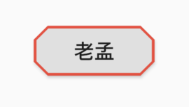

如果设置的半径比控件还大，就会变成**菱形**：

```dart
 3RaisedButton(
  shape: BeveledRectangleBorder(
      side: BorderSide(width: 1, color: Colors.red),
      borderRadius: BorderRadius.circular(100)),
  child: Text('老孟'),
  onPressed: () {},
)
```

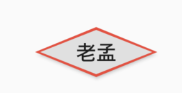

同理，如果半径设置为0，就是矩形。

```dart
RaisedButton(
  shape: BeveledRectangleBorder(
      side: BorderSide(width: 1, color: Colors.red),
      borderRadius: BorderRadius.circular(0)),
  child: Text('老孟'),
  onPressed: () {},
)
```

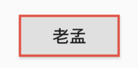


## Border

Border允许单独设置每一个边上的线条样式.

```dart
RaisedButton(
  shape: Border(
    top: BorderSide(color: Colors.red,width: 2)
  ),
  child: Text('老孟'),
  onPressed: () {},
)
```

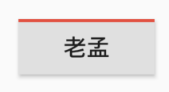


设置全部

```dart
RaisedButton(
        shape: Border(
          top: BorderSide(color: Colors.red,width: 10),
          right: BorderSide(color: Colors.blue,width: 10),
          bottom: BorderSide(color: Colors.yellow,width: 10),
          left: BorderSide(color: Colors.green,width: 10),
        ),
        child: Text('老孟'),
        onPressed: () {},
      )
```

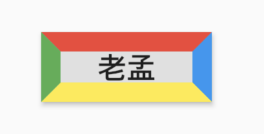


## BorderDirectional

**BorderDirectional**和**Border**基本一样，区别就是**BorderDirectional**带有阅读方向，大部分国家阅读是从左到右，但有的国家是从右到左的，比如阿拉伯等。

```dart
RaisedButton(
  shape: BorderDirectional(
    start: BorderSide(color: Colors.red,width: 2),
    end: BorderSide(color: Colors.blue,width: 2),
  ),
  child: Text('老孟'),
  onPressed: () {},
)
```

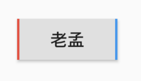

## CircleBorder

圆形

```dart
RaisedButton(
  shape: CircleBorder(side: BorderSide(color: Colors.red)),
  child: Text('老孟'),
  onPressed: () {},
)
```

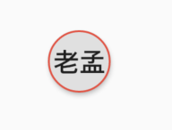

## ContinuousRectangleBorder

连续的圆角矩形，直线和圆角平滑连续的过渡，和RoundedRectangleBorder相比，圆角效果会小一些。

```dart
RaisedButton(
  shape: ContinuousRectangleBorder(
      side: BorderSide(color: Colors.red),
      borderRadius: BorderRadius.circular(20)),
  child: Text('老孟'),
  onPressed: () {},
)
```

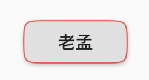


## RoundedRectangleBorder

圆角矩形

```dart
RaisedButton(
  shape: RoundedRectangleBorder(
      side: BorderSide(color: Colors.red),
      borderRadius: BorderRadius.circular(10)),
  child: Text('老孟'),
  onPressed: () {},
)
```

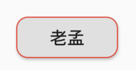

## StadiumBorder

类似**足球场**的形状，两边圆形，中间矩形

```dart
RaisedButton(
  shape: StadiumBorder(
      side: BorderSide(color: Colors.red),),
  child: Text('老孟'),
  onPressed: () {},
)
```

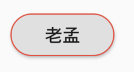

## OutlineInputBorder

带外边框

```dart
RaisedButton(
  shape: OutlineInputBorder(
    borderSide: BorderSide(color: Colors.red),
    borderRadius: BorderRadius.circular(10),
  ),
  child: Text('老孟'),
  onPressed: () {},
)
```

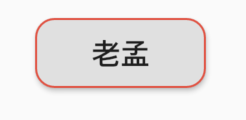

## UnderlineInputBorder

下划线边框

```dart
RaisedButton(
  shape: UnderlineInputBorder(
    borderSide: BorderSide(color: Colors.red),
  ),
  child: Text('老孟'),
  onPressed: () {},
)
```

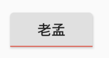

