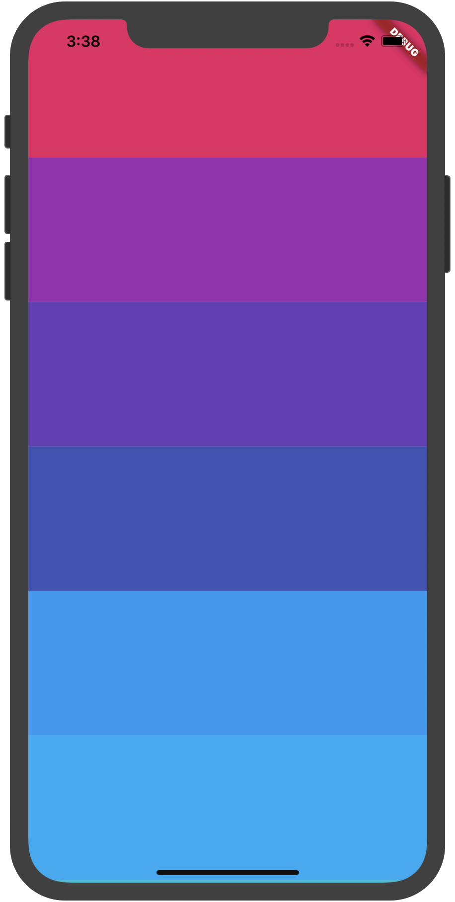

## SingleChildScrollView

当遇到内容较多时，需要滚动组件进行展示，SingleChildScrollView是一个只能包含单个组件的滚动组件，如果内容较多，建议使用ListView等，因为SingleChildScrollView没有“懒加载”模式，性能不如ListView。


```dart
SingleChildScrollView(
  child: Column(
    children: List.generate(50, (index) {
      return Container(
        height: 150,
        color: Colors.primaries[index % Colors.primaries.length],
      );
    }).toList(),
  ),
)
```

效果如下，可垂直滚动：



设置水平滚动：

```dart
SingleChildScrollView(
  scrollDirection: Axis.horizontal
  ...
)
```


`reverse`参数表示反转滚动方向，并不是有垂直转为水平，而是垂直方向滚动时，默认向下滚动，`reverse`设置false，滚动方向改为向上，同理水平滚动改为水平向左。

```dart
SingleChildScrollView(
  reverse: false,
  ...
)
```


设置内边距Padding：

```dart
SingleChildScrollView(
  padding: EdgeInsets.all(10),
  ...
)
```


`primary`设置为true时，不能设置`controller`，因为`primary`true时，`controller`使用PrimaryScrollController，这种机制带来的好处是父组件可以控制子树中可滚动组件的滚动行为，例如，Scaffold正是使用这种机制在iOS中实现了点击导航栏回到顶部的功能。

也可以设置其他controller：

```dart
SingleChildScrollView(
  controller: ScrollController(),
  ...
)
```


`physics`表示滚动视图应如何响应用户输入。

系统提供的ScrollPhysics有：

- AlwaysScrollableScrollPhysics：总是可以滑动
- NeverScrollableScrollPhysics：禁止滚动
- BouncingScrollPhysics ：内容超过一屏 上拉有回弹效果
- ClampingScrollPhysics ：包裹内容 不会有回弹

