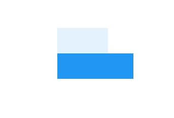

## SizedOverflowBox

是SizedBox与OverflowBox的结合体。一个特定大小的widget，但是会将它的原始约束传递给它的子组件，它可能会溢出。

```dart
SizedOverflowBox({
    Key key,
    @required this.size,//固定的尺寸。
    this.alignment = Alignment.center,//对齐方式。
    Widget child,
  })
```

SizedOverflowBox主要的布局行为有两点：

- 尺寸部分。通过将自身的固定尺寸，传递给child，来达到控制child尺寸的目的；
- 超出部分。可以突破父节点尺寸的限制，超出部分也可以被渲染显示，与OverflowBox类似。

案例

```dart
Container(
  color: Colors.blue[50],
  child: SizedOverflowBox(
    size: const Size(100.0, 100.0),
    alignment: AlignmentDirectional.bottomStart,
    child: Container(height: 50.0, width: 150.0, color: Colors.blue,),
  ),
)
```




本文由[**Rock**]()提供。