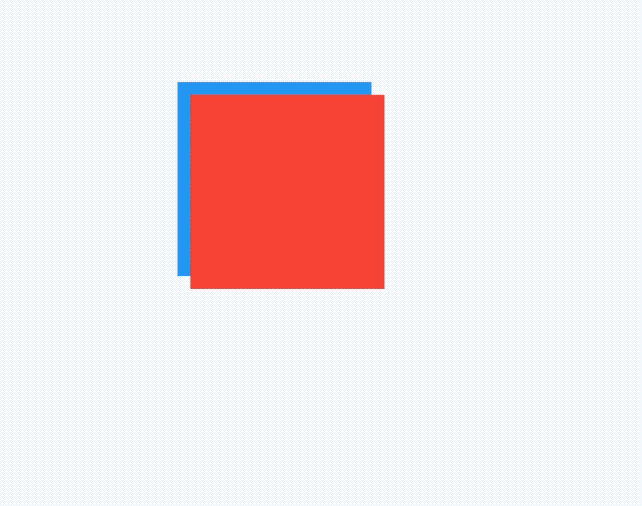

## SlideTransition

平移动画，用法如下：

```dart
class AnimationDemo extends StatefulWidget {
  @override
  State<StatefulWidget> createState() => _AnimationDemo();
}

class _AnimationDemo extends State<AnimationDemo>
    with SingleTickerProviderStateMixin {
  AnimationController _animationController;
  Animation _animation;

  @override
  void initState() {
    _animationController =
        AnimationController(duration: Duration(seconds: 2), vsync: this);

    _animation = Tween(begin: Offset(0.0,0.0), end: Offset(1.0,1.0)).animate(_animationController);

    
    
    super.initState();
  }

  @override
  Widget build(BuildContext context) {

    return Container(
      color: Colors.blue,
      height: 100,
      width: 100,
      child: SlideTransition(
        position: _animation,
        child: Container(
          color: Colors.red,
        ),
      ),
    );
  }

  @override
  void dispose() {
    _animationController.dispose();
    super.dispose();
  }
}
```

Tween中设置Offset的值是比例，1表示父组件的宽高。

效果如下：



