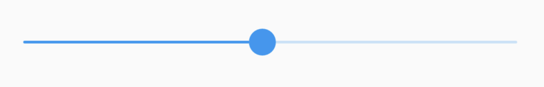
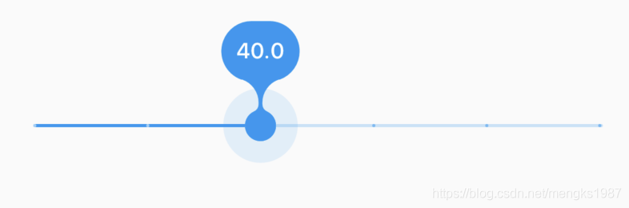
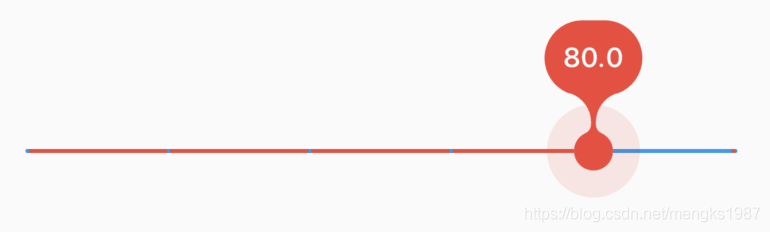
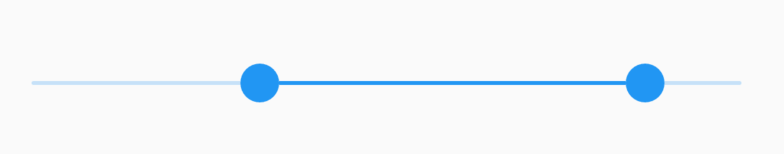

## Slider

Slider可以快速的从一系列值中做出选择，Slider需要设置`value`和`onChanged`属性，用法如下：

```dart
double _sliderValue = 0;
Slider(
  value: _sliderValue,
  onChanged: (v){
    setState(() {
      _sliderValue = v;
    });
  },
)
```

如果不设置`onChanged`属性，Slider控件处于禁用状态，不可滑动，另外Slider控件本身没有滑动效果，需要通过`onChanged`回调动态改变value的值，效果如下：



更改Slider值的范围：

```dart
Slider(
  min: 0,
  max: 100,
  ...
  ）
```

通过设置`divisions`属性使Slider停留在某些点上，Slider只能滑动到这些点，效果如下：


注意看Slider上分了3个点。

设置`label`参数则可以在拖动Slider时在其上方显示一个标签，显示标签需要设置`divisions`参数：

```
Slider(
  label: '$_sliderValue',
  divisions: 5,
  ...
  )
```

效果如下：



通过`activeColor`和`inactiveColor`参数设置其颜色：

```
Slider(
  activeColor: Colors.red,
  inactiveColor: Colors.blue,
  ...
  )
```

效果如下：



## RangeSlider

如果想要选择一段值，可以使用RangeSlider，用法和Slider一样，如下：

```dart
RangeValues _rangeValues = RangeValues(0, 1);
RangeSlider(
  values: _rangeValues,
  onChanged: (v) {
    setState(() {
      _rangeValues = v;
    });
  },
)
```

效果：



## CupertinoSlider

如果想用ios风格的Slider，可以使用CupertinoSlider:

```
double _sliderValue = 0;
CupertinoSlider(
  value: _sliderValue,
  onChanged: (v) {
    setState(() {
      _sliderValue = v;
    });
  },
)
```

效果如下：


当然我们也可以根据平台显示不同风格的Slider，ios平台显示CupertinoSlider效果，其他平台显示Material风格，用法如下：

```dart
Slider.adaptive(
  value: _sliderValue,
  onChanged: (v) {
    setState(() {
      _sliderValue = v;
    });
  },
)
```

