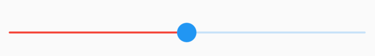
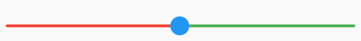
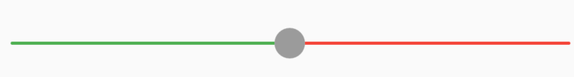
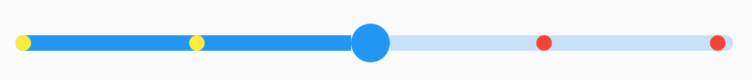
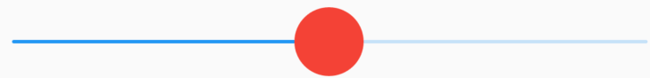
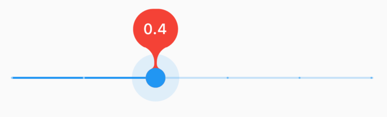
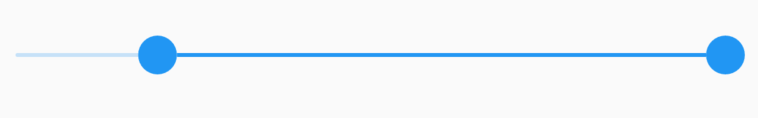
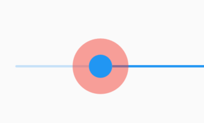

# SliderTheme

用于**Slider**样式。

```dart
SliderTheme(
  data: SliderTheme.of(context).copyWith(activeTrackColor: Colors.red),
  child: Slider(
    value: .5,
    onChanged: (value) {},
  ),
)
```




## SliderThemeData

轨道相关属性：

- trackHeight：轨道的高度

- trackShape：轨道的形状
- activeTrackColor：已滑过轨道的颜色
- inactiveTrackColor：未滑过轨道的颜色


```dart
 SliderTheme(
  data: SliderTheme.of(context).copyWith(
    trackHeight: 3,
    activeTrackColor: Colors.red,
    inactiveTrackColor: Colors.green
  ),
  child: Slider(
    value: .5,
    onChanged: (value) {},
  ),
)
```




禁用状态下轨道样式，`onChanged`不设置就是禁用状态：

```dart
SliderTheme(
  data: SliderTheme.of(context).copyWith(
      disabledActiveTrackColor: Colors.green,
      disabledInactiveTrackColor:Colors.red,
  ),
  child: Slider(
    value: .5,
  ),
)
```



分段样式介绍：

- activeTickMarkColor：已滑过分割点点颜色（设置divisions的值）
- inactiveTickMarkColor：未滑过分割点点颜色（设置divisions的值）
- disabledActiveTickMarkColor：禁用状态下已滑过分割点点颜色（设置divisions的值）
- disabledInactiveTickMarkColor：禁用状态下未滑过分割点点颜色（设置divisions的值）
- tickMarkShape：分割点形状

`onChanged`不设置就是禁用状态。

```dart
SliderTheme(
  data: SliderTheme.of(context).copyWith(
    trackHeight: 8,
    activeTickMarkColor: Colors.yellow,
    inactiveTickMarkColor: Colors.red,
  ),
  child: Slider(
    value: .5,
    divisions: 4,
    onChanged: (value) {},
  ),
)
```




滑块样式：

- thumbColor：滑块颜色
- thumbShape：滑块形状
- disabledThumbColor：禁用状态滑块颜色

```dart
SliderTheme(
  data: SliderTheme.of(context).copyWith(
    thumbColor: Colors.red,
    thumbShape: RoundSliderThumbShape(enabledThumbRadius: 20),
    disabledThumbColor: Colors.yellow,
  ),
  child: Slider(
    value: .5,
    onChanged: (value) {},
  ),
)
```




滑动指示器样式：

- valueIndicatorColor：指示器颜色
- valueIndicatorShape：指示器形状
- valueIndicatorTextStyle：指示器文本样式
- ShowValueIndicator：指示器显示类型
  -  onlyForDiscrete：分段时显示，设置了`divisions`
  -  onlyForContinuous：连续时显示，`divisions`不设置
  -  always：总显示
  -  never：不显示

```dart
SliderTheme(
  data: SliderTheme.of(context).copyWith(
      valueIndicatorColor: Colors.red,
  ),
  child: Slider(
    value: _slideValue,
    label: '$_slideValue',
    divisions: 5,
    onChanged: (value) {
      setState(() {
        _slideValue = value;
      });
    },
  ),
)
```




 RangeSlider样式：

- rangeTickMarkShape：RangeSlider分段形状
- rangeThumbShape：RangeSlider滑块形状
- rangeTrackShape：RangeSlider轨道形状
- rangeValueIndicatorShape：RangeSlider 指示器形状

```dart
SliderTheme(
  data: SliderTheme.of(context).copyWith(
    rangeTrackShape: RoundedRectRangeSliderTrackShape()
  ),
  child: RangeSlider(
    values: RangeValues(0.2,1.0),
    onChanged: (value) {
      setState(() {

      });
    },
  ),
)
```




`thumbSelector`确定交互时选中哪个滑块，默认接近哪个选中哪个，下面设置只能选中前面的：

```dart
SliderTheme(
  data: SliderTheme.of(context).copyWith(thumbSelector: (
    TextDirection textDirection,
    RangeValues values,
    double tapValue,
    Size thumbSize,
    Size trackSize,
    double dx,
  ) {
    return Thumb.start;
  }),
  child: RangeSlider(
    values: RangeValues(0.2, 1.0),
    onChanged: (value) {
      setState(() {});
    },
  ),
)
```

滑块按下时叠加的样式：

- overlayColor：滑块周围颜色，默认半透明
- overlayShape：滑块周围的形状


```dart
SliderTheme(
  data: SliderTheme.of(context).copyWith(
     overlayColor: Colors.red.withOpacity(.5)
  ),
  child: RangeSlider(
    values: RangeValues(0.2, 1.0),
    onChanged: (value) {
      setState(() {});
    },
  ),
)
```




