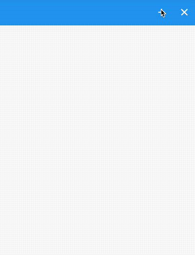
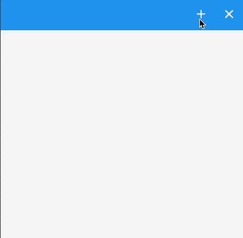

# SliverAnimatedList

SliverAnimatedList是带动画的SliverList组件，但列表数据增加或者减少时，以动画的形式展现，定义一个`增加`和`删除`按钮，另外列表数据变化时不仅要改变数据源，还要使用如下方式增加或者删除数据：

```dart
SliverAnimatedListState.insertItem 
SliverAnimatedListState.removeItem
```

获取SliverAnimatedListState有2种方式：

1. 通过context获取

```dart
SliverAnimatedList.of(context)
```

2. 设置key

```dart
var _key = GlobalKey<SliverAnimatedListState>();
SliverAnimatedList(
	key: _key,
	...
)
```


用例如下：

```dart
List<int> _list = [];
var _key = GlobalKey<SliverAnimatedListState>();

@override
  Widget build(BuildContext context) {   
return CustomScrollView(
  slivers: <Widget>[
    SliverAppBar(
      actions: <Widget>[
        IconButton(
          icon: Icon(Icons.add),
          onPressed: () {
            SliverAnimatedList.of(context)
            final int _index = _list.length;
            _list.insert(_index, _index);
            _key.currentState.insertItem(_index);
          },
        ),
        IconButton(
          icon: Icon(Icons.clear),
          onPressed: () {
            final int _index = _list.length - 1;
            var item = _list[_index].toString();
            _key.currentState.removeItem(_index,
                (context, animation) => _buildItem(item, animation));
            _list.removeAt(_index);
          },
        ),
      ],
    ),
    SliverAnimatedList(
      key: _key,
      initialItemCount: _list.length,
      itemBuilder:
          (BuildContext context, int index, Animation<double> animation) {
        return _buildItem(_list[index].toString(), animation);
      },
    ),
  ],
);
  }

```

动画重点

```dart
Widget _buildItem(String _item, Animation _animation) {
  return SlideTransition(
    position: _animation
        .drive(CurveTween(curve: Curves.easeIn))
        .drive(Tween<Offset>(begin: Offset(1, 1), end: Offset(0, 1))),
    child: Card(
      child: ListTile(
        title: Text(
          _item,
        ),
      ),
    ),
  );
}
```




换一种效果，实现从上掉落的效果，只需将_buildItem方法代码修改如下即可：

```dart
Widget _buildItem(String _item, Animation _animation) {
  return SizeTransition(
    sizeFactor: _animation,
    child: Card(
      child: ListTile(
        title: Text(
          _item,
        ),
      ),
    ),
  );
}
```



