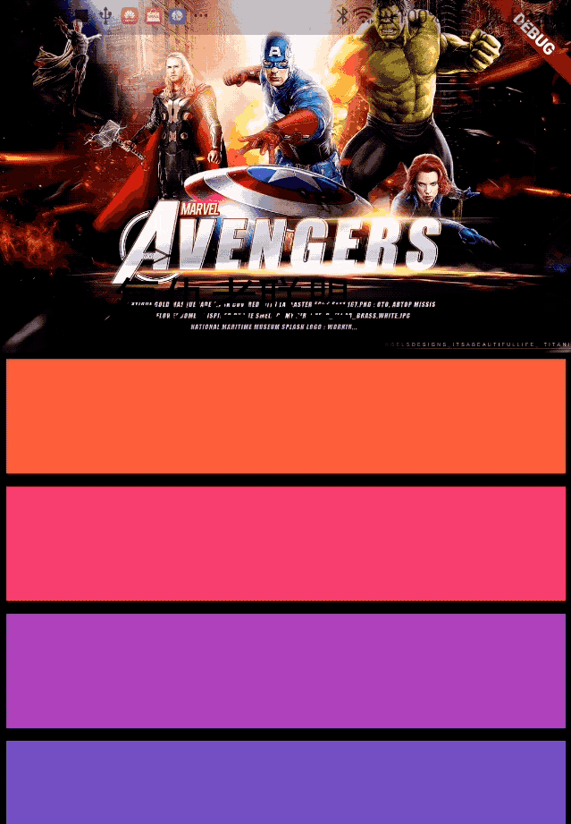

# SliverAppBar

SliverAppBar控件可以实现页面头部区域展开、折叠的效果，类似于Android中的CollapsingToolbarLayout。
先看下SliverAppBar实现的效果，效果图如下：



SliverAppBar控件需要和CustomScrollView搭配使用,SliverAppBar要通常放在slivers的第一位，后面接其他sliver控件。
```
CustomScrollView(
      slivers: <Widget>[
        SliverAppBar(
          
        ),
        //其他sliver控件
      ],
    )
```
SliverAppBar和其他slivers控件的结构如下：

SliverAppBar中有一个非常重要的参数flexibleSpace，flexibleSpace是SliverAppBar中展开和折叠区域，flexibleSpace与expandedHeight一起使用，
expandedHeight表示flexibleSpace的高度，
```
SliverAppBar(
          expandedHeight: 200.0,
          flexibleSpace: FlexibleSpaceBar(
          
          ),
        ),
```

SliverAppBar其他常用属性说明如下：
| 属性 | 说明 |
|--|--|
| leading | 左侧控件，通常情况下为"返回"图标 |
| title | 标题，通常为Text控件  |
| actions | 右侧控件 |
| flexibleSpace | 展开和折叠区域 |
| bottom | 底部控件 |
| elevation | 阴影 |
| backgroundColor | 背景颜色 |
| expandedHeight | 展开区域的高度 |
| floating | 设置为true时，向下滑动时，即使当前CustomScrollView不在顶部，SliverAppBar也会跟着一起向下出现 |
| pinned | 设置为true时，当SliverAppBar内容滑出屏幕时，将始终渲染一个固定在顶部的收起状态 |
| snap | 设置为true时，当手指放开时，SliverAppBar会根据当前的位置进行调整，始终保持展开或收起的状态，此效果在floating=true时生效 |


实现文章开头效果的整体代码如下：
```
class SliverAppBarDemo extends StatelessWidget {
  @override
  Widget build(BuildContext context) {
    return CustomScrollView(
      slivers: <Widget>[
        SliverAppBar(
          pinned: true,
          expandedHeight: 200.0,
          flexibleSpace: FlexibleSpaceBar(
            title: Text('复仇者联盟'),
            background: Image.network(
              'http://img.haote.com/upload/20180918/2018091815372344164.jpg',
              fit: BoxFit.fitHeight,
            ),
          ),
        ),
        SliverFixedExtentList(
          itemExtent: 80.0,
          delegate: SliverChildBuilderDelegate(
            (BuildContext context, int index) {
              return Card(
                child: Container(
                  alignment: Alignment.center,
                  color: Colors.primaries[(index % 18)],
                  child: Text(''),
                ),
              );
            },
          ),
        ),
      ],
    );
  }
}
```

