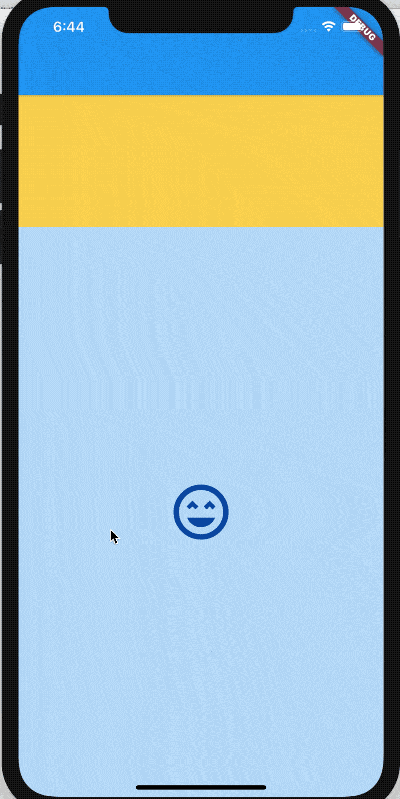

# SliverFillRemaining

SliverFillRemaining是sliver系列组件之一，此组件充满视口**剩余空间**，通常用于最后一个sliver组件，以便于没有任何剩余控件。

```dart
CustomScrollView(
  slivers: <Widget>[
    SliverToBoxAdapter(
      child: Container(
        color: Colors.amber[300],
        height: 150.0,
      ),
    ),
    SliverFillRemaining(
      hasScrollBody: false,
      child: Container(
        color: Colors.blue[100],
        child: Icon(
          Icons.sentiment_very_satisfied,
          size: 75,
          color: Colors.blue[900],
        ),
      ),
    ),
  ],
)
```




`hasScrollBody`表示内容是否可以滚动，比如上面的例子，设置为false，向上滑动松手后，自动回到原位置，如果设置为true，向上滑动松手后，不会自动回到原位置。

`fillOverscroll`表示子控件是否应该应该伸展以填充超出区域（比如iOS的ListView默认可伸展出一部分区域），当`hasScrollBody`为false时才起作用。

