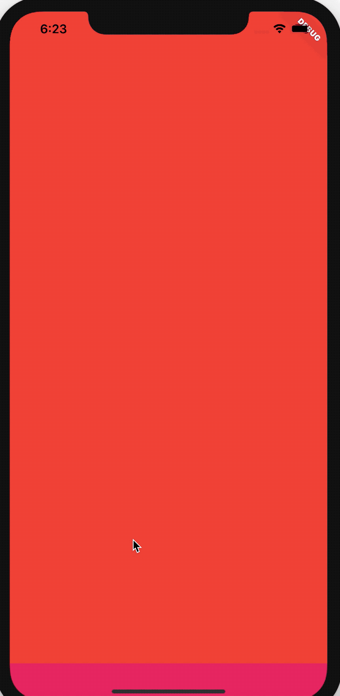
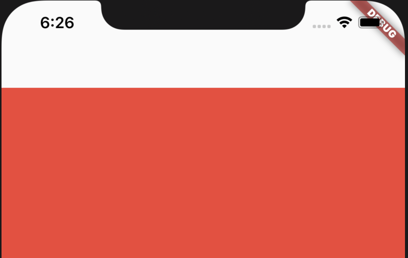

## SliverFillViewport


SliverFillViewport生成的每一个item都占满全屏，用法如下：

```dart
CustomScrollView(
  slivers: <Widget>[
    SliverFillViewport(
      delegate: SliverChildBuilderDelegate((context, index) {
        return Container(
          color: Colors.primaries[index % Colors.primaries.length],
        );
      }, childCount: 4),
      viewportFraction: 1.0,
    )
  ],
)
```

效果如下：



`viewportFraction`表示比率，默认是1，表示占满全屏，如果设置0.8，则在开始和结尾处出现空白，如下：



