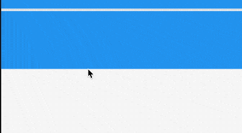

# SliverLayoutBuilder

根据组件的约束条件提供子组件，比如当用户向下划动时，盒子显示红色，向上滑动时显示蓝色：

```dart
CustomScrollView(
  slivers: <Widget>[
    SliverLayoutBuilder(
      builder: (BuildContext context, SliverConstraints constraints) {
        print('${constraints.userScrollDirection}');
        var color = Colors.red;
        if (constraints.userScrollDirection == ScrollDirection.forward) {
          color = Colors.blue;
        }
        return SliverToBoxAdapter(
            child: Container(
          height: 100,
          color: color,
        ));
      },
    ),
  ],
)
```



