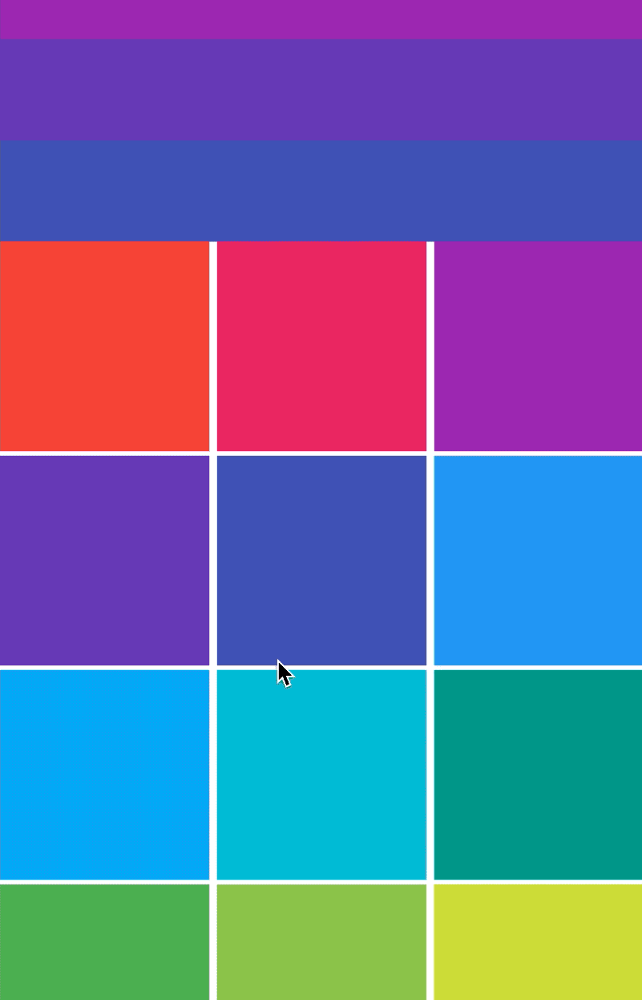

# SliverList

要同时滚动ListView和GridView的时候可以使用SliverList和SliverGrid。


## SliverList

SliverList的用法非常简单，只需一个构建函数，用法如下：

```dart
SliverList(
  delegate: SliverChildBuilderDelegate((content, index) {
    return Container(
      height: 65,
      color: Colors.primaries[index % Colors.primaries.length],
    );
  }, childCount: 5),
)
```


## SliverGrid

同样SliverGrid的用法如下：

```dart
SliverGrid(
  gridDelegate: SliverGridDelegateWithFixedCrossAxisCount(
      crossAxisCount: 3, crossAxisSpacing: 5, mainAxisSpacing: 3),
  delegate: SliverChildBuilderDelegate((BuildContext context, int index) {
    return Container(
      color: Colors.primaries[index % Colors.primaries.length],
    );
  }, childCount: 20),
)
```


此时需要将SliverList和SliverGrid放在一起，使用CustomScrollView，用法如下：

```dart
CustomScrollView(slivers: <Widget>[
  SliverList(
    delegate: SliverChildBuilderDelegate((content, index) {
      return Container(
        height: 65,
        color: Colors.primaries[index % Colors.primaries.length],
      );
    }, childCount: 5),
  ),
  SliverGrid(
    gridDelegate: SliverGridDelegateWithFixedCrossAxisCount(
        crossAxisCount: 3, crossAxisSpacing: 5, mainAxisSpacing: 3),
    delegate: SliverChildBuilderDelegate((BuildContext context, int index) {
      return Container(
        color: Colors.primaries[index % Colors.primaries.length],
      );
    }, childCount: 20),
  )
])
```

效果如下：

