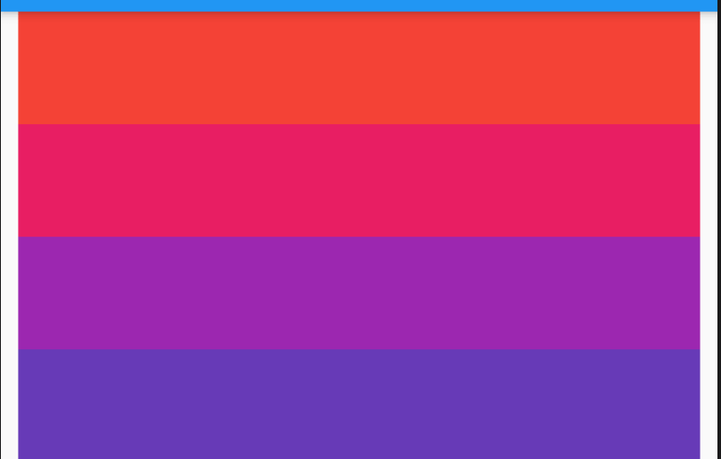
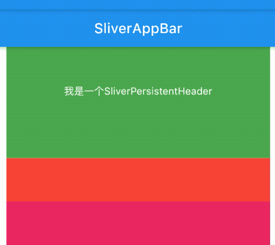

# SliverPadding

SliverPadding 组件是sliver系列的Padding组件，配合CustomScrollView使用。

比如给CustomScrollView中SliverList添加内边距：

```dart
CustomScrollView(
  slivers: <Widget>[
    SliverPadding(
      padding: EdgeInsets.symmetric(horizontal: 10),
      sliver: SliverList(
        delegate: SliverChildBuilderDelegate((content, index) {
          return Container(
            height: 65,
            color: Colors.primaries[index % Colors.primaries.length],
          );
        }, childCount: 50),
      ),
    )
  ],
)
```




有时使用SliverPadding会出现一些意想不到的问题，比如，使用SliverPadding包裹SliverPersistentHeader（`pinned:true`），会出现SliverPersistentHeader和SliverAppBar重叠的问题，问题代码如下：

```dart
CustomScrollView(
  slivers: <Widget>[
    SliverAppBar(
      title: Text('SliverAppBar'),
      pinned: true,
    ),
    SliverPadding(
      padding: EdgeInsets.symmetric(horizontal: 10),
      sliver: SliverPersistentHeader(
        delegate: MySliverPersistentHeaderDelegate(),
        pinned: true,
      ),
    ),
    SliverPadding(
      padding: EdgeInsets.symmetric(horizontal: 10),
      sliver: SliverList(
        delegate: SliverChildBuilderDelegate((content, index) {
          return Container(
            height: 65,
            color: Colors.primaries[index % Colors.primaries.length],
          );
        }, childCount: 50),
      ),
    )
  ],
)
```



通过上面的效果图发现SliverPersistentHeader和SliverAppBar发生了重叠。