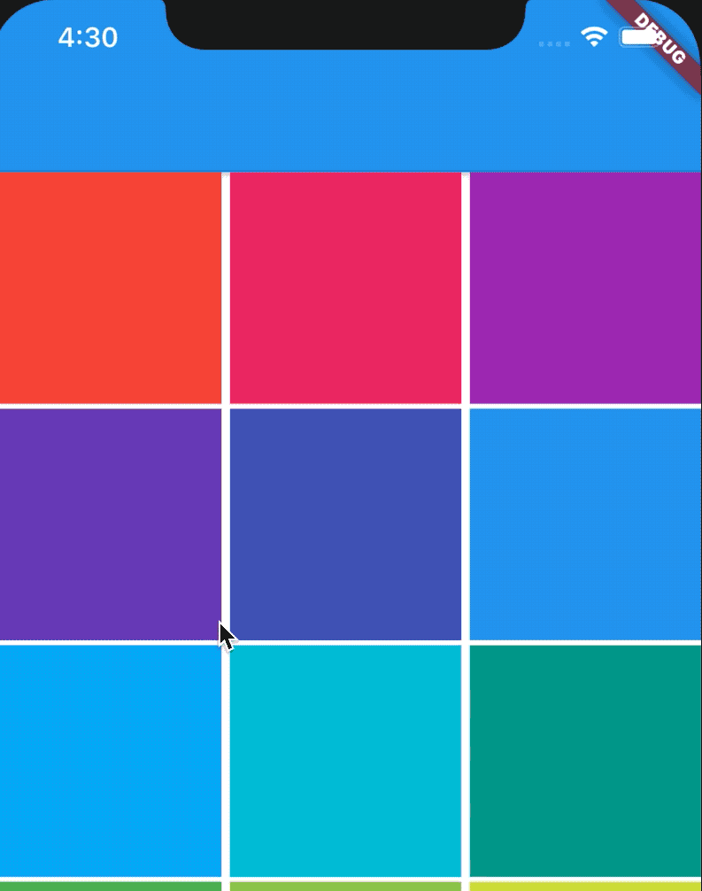
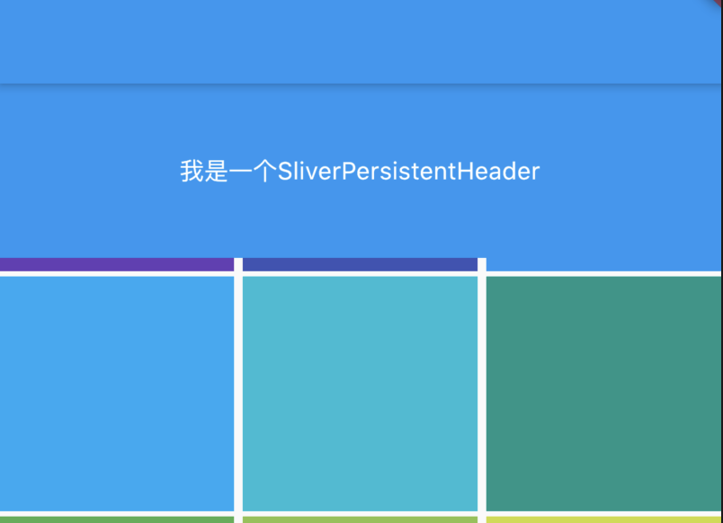

## SliverPersistentHeader

`SliverPersistentHeader`控件当滚动到边缘时根据滚动的距离缩小高度，有点类似 `SliverAppBar` 的背景效果。

用法如下：

```dart
CustomScrollView(
  slivers: <Widget>[
    SliverPersistentHeader(
      delegate: MySliverPersistentHeaderDelegate(),
    ),
    SliverGrid(
      gridDelegate: SliverGridDelegateWithFixedCrossAxisCount(
          crossAxisCount: 3, crossAxisSpacing: 5, mainAxisSpacing: 3),
      delegate:
          SliverChildBuilderDelegate((BuildContext context, int index) {
        return Container(
          color: Colors.primaries[index % Colors.primaries.length],
        );
      }, childCount: 20),
    )
  ],
)
```

MySliverPersistentHeaderDelegate定义如下：

```dart
class MySliverPersistentHeaderDelegate extends SliverPersistentHeaderDelegate {
  @override
  Widget build(
      BuildContext context, double shrinkOffset, bool overlapsContent) {
    return Container(
        color: Colors.blue,
        alignment: Alignment.center,
        child: Text('我是一个SliverPersistentHeader',
            style: TextStyle(color: Colors.white)));
  }

  @override
  double get maxExtent => 200.0;

  @override
  double get minExtent => 100.0;

  @override
  bool shouldRebuild(SliverPersistentHeaderDelegate oldDelegate) =>
      false; // 如果内容需要更新，设置为true
}
```

SliverPersistentHeader的`delegate`需要我们自定义，`build`返回显示的内容，`maxExtent`和`minExtent`表示最大和最小值，滚动的时候高度在这个范围内变化。

`shouldRebuild`表示是否需要更新，如果内容需要变化需要设置为true。

效果如下：



设置悬停在顶部：

```dart
SliverPersistentHeader(
  pinned: true,
  ...
)
```

效果如下：




`floating`  设置为true时，向下滑动时，即使当前CustomScrollView不在顶部，SliverAppBar也会跟着一起向下出现  

`pinned` 设置为true时，当SliverAppBar内容滑出屏幕时，将始终渲染一个固定在顶部的收起状态

