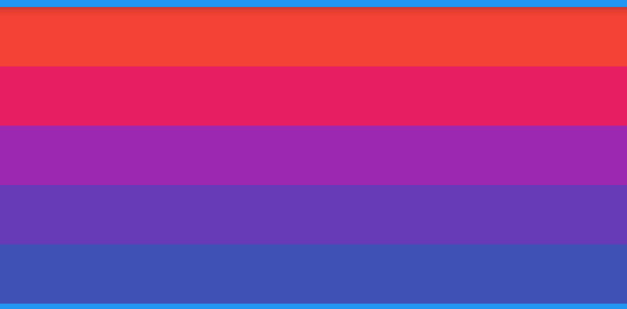

# SliverPrototypeExtentList

SliverPrototypeExtentList和**SliverList**用法一样，区别是SliverPrototypeExtentList的高度由`prototypeItem`控件决定。

SliverPrototypeExtentList 比SliverList更加高效，因为SliverFixedExtentList无需计算子控件的布局。

SliverPrototypeExtentList比SliverFixedExtentList更加灵活，因为SliverPrototypeExtentList不必指定像素高度。

SliverPrototypeExtentList通常用于不确定item高度，随`prototypeItem`变化的场景,比如调整整个App字体的大小，字体越大，需要的高度越高，如果使用SliverFixedExtentList指定具体的高度，会出现字体显示不全的状况。

用法如下：

```dart
CustomScrollView(
  slivers: <Widget>[
    SliverPrototypeExtentList(
      prototypeItem: Text('老孟',style: TextStyle(fontSize: 28),),
      delegate: SliverChildBuilderDelegate((content, index) {
        return Container(
          color: Colors.primaries[index % Colors.primaries.length],
        );
      }, childCount: 50),
    ),
  ],
)
```



