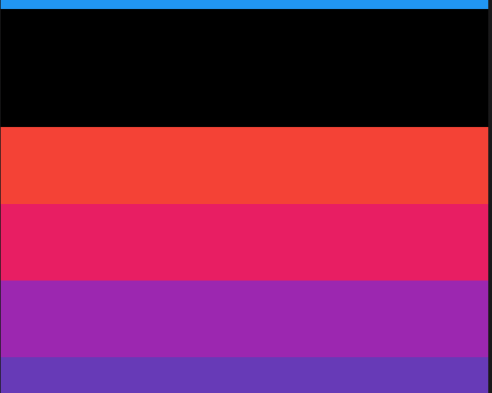

# SliverToBoxAdapter

在使用**CustomScrollView**创建自定义滚动效果的时候，**CustomScrollView**只能包含sliver系列组件，如果包含普通的组件如何处理？使用SliverToBoxAdapter包裹。

```dart
CustomScrollView(
  slivers: <Widget>[
    SliverToBoxAdapter(
      child: Container(
        height: 100,
        color: Colors.black,
      ),
    ),
    SliverList(
      delegate: SliverChildBuilderDelegate((content, index) {
        return Container(
          height: 65,
          color: Colors.primaries[index % Colors.primaries.length],
        );
      }, childCount: 50),
    )
  ],
)
```




黑色区域就是SliverToBoxAdapter包裹的部分。