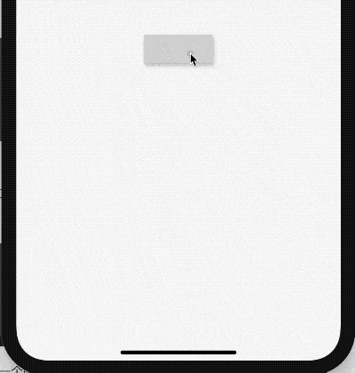

## SnackBar

带有可选操作的轻量级消息，在屏幕底部短暂显示，SnackBar一般不单独使用，而是配合`Scaffold.of(context).showSnackBar`进行弹出展示。

```dart
RaisedButton(
  onPressed: () {
    Scaffold.of(context).showSnackBar(SnackBar(
      content: Text('老孟，专注分享Flutter相关技术'),
    ));
  },
)
```



设置背景和形状：

```dart
Scaffold.of(context).showSnackBar(SnackBar(
  backgroundColor: Colors.red,
  elevation: 8,
  shape: RoundedRectangleBorder(borderRadius: BorderRadius.circular(100)),
  content: Text('老孟，专注分享Flutter相关技术'),
));
```


`content`属性不一定是文字，也可以是其他组件，比如显示一个图标和文字：

```dart
Scaffold.of(context).showSnackBar(SnackBar(
  content: Row(
    children: <Widget>[
      Icon(Icons.check,color: Colors.green,),
      Text('下载成功')],
  ),
  duration: Duration(seconds: 1),
));
```


设置显示时间，默认是4秒：

```dart
Scaffold.of(context).showSnackBar(SnackBar(
  duration: Duration(seconds: 2),
  content: Text('老孟，专注分享Flutter相关技术'),
));
```

`onVisible`属性是在显示的时候调用。

SnackBar的有2种弹出形式，默认是`fixed`，直接在底部弹出，另一种是`floating`,悬浮在底部，用法如下：

```dart
Scaffold.of(context).showSnackBar(SnackBar(
            content: Row(
              children: <Widget>[
                Icon(Icons.check,color: Colors.green,),
                Text('下载成功')],
            ),
            behavior: SnackBarBehavior.floating,
          ));
```

`floating`效果：


## SnackBarAction

SnackBarAction 用在SnackBar中，

```dart
Scaffold.of(context).showSnackBar(SnackBar(
  action: SnackBarAction(
    label: '确定',
    onPressed: () {
      print('确定');
    },
  ),
  content: Text('老孟，专注分享Flutter相关技术'),
));
```


## 瞬间多个弹出延迟问题

当短时间内多次调用SnackBar方法时，SnackBar消息将会以队列的形式一个一个的弹出，比如下面的代码：

```
RaisedButton(
          child: Text(
            '点我，弹出SnackBar',
          ),
          onPressed: () {

            List.generate(10, (index){
              Scaffold.of(context).showSnackBar(SnackBar(
                content: Text('我是消息：$index'),
              ));
            });
          },
        )
```

默认情况下每个显示4秒，如果有10个，那么40秒内会一直弹消息，体验明显不友好，我们希望的效果是如果有新的消息时，旧的都消息立刻消失，显示新的消息,只需在弹出新的SnackBar时移除现在的SnackBar，

```
Scaffold.of(context).removeCurrentSnackBar();
Scaffold.of(context).showSnackBar(...);
```


