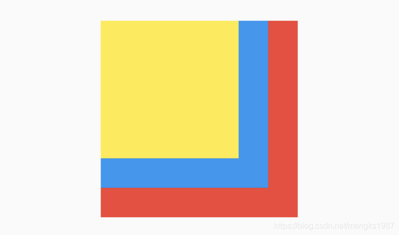
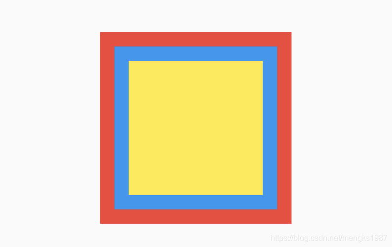
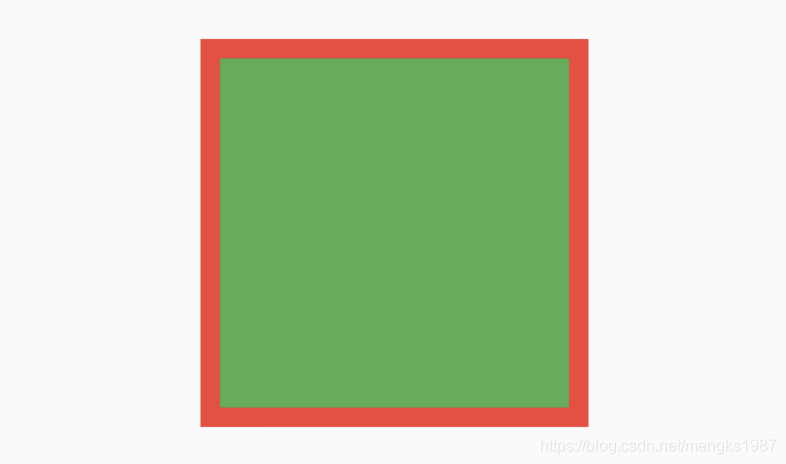
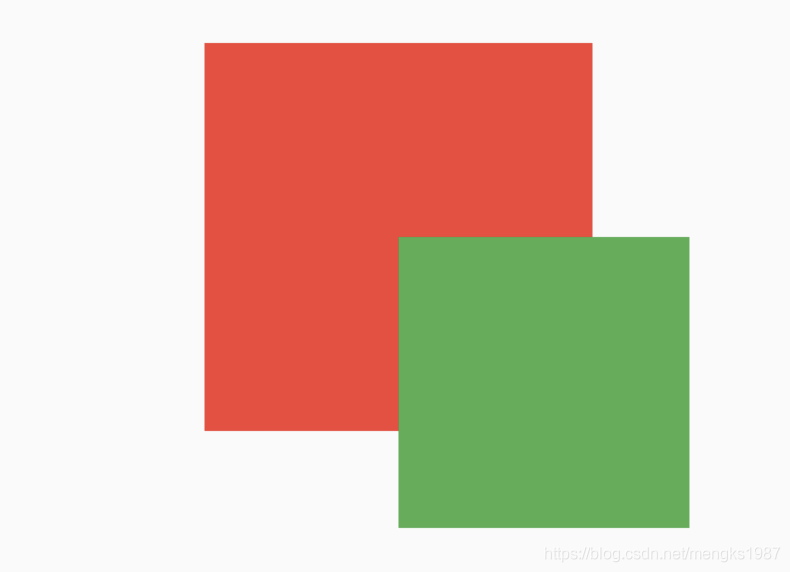
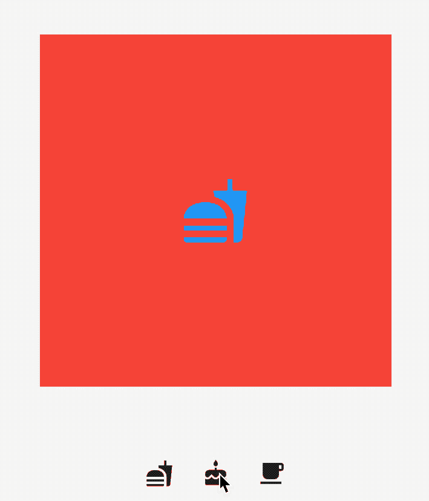

## Stack

Stack组件可以将子组件叠加显示，根据子组件的顺利依次向上叠加，用法如下：

```dart
Stack(
  children: <Widget>[
    Container(
      height: 200,
      width: 200,
      color: Colors.red,
    ),
    Container(
      height: 170,
      width: 170,
      color: Colors.blue,
    ),
    Container(
      height: 140,
      width: 140,
      color: Colors.yellow,
    )
  ],
)
```

效果如下：



Stack未定位的子组件大小由`fit`参数决定，默认值是`StackFit.loose`，表示子组件自己决定，`StackFit.expand`表示尽可能的大，用法如下：

```
Stack(
  fit: StackFit.expand,
  ...
)
```

Stack未定位的子组件的默认左上角对齐，通过`alignment`参数控制，用法如下：

```
Stack(
  alignment: Alignment.center,
  ...
)
```

效果如下：



有没有注意到`fit`和`alignment`参数控制的都是未定位的子组件，那什么样的组件叫做定位的子组件？使用Positioned包裹的子组件就是定位的子组件，用法如下：

```dart
Stack(
  alignment: Alignment.center,
  children: <Widget>[
    Container(
      height: 200,
      width: 200,
      color: Colors.red,
    ),
    Positioned(
      left: 10,
      right: 10,
      bottom: 10,
      top: 10,
      child: Container(
        color: Colors.green,
      ),
    )
  ],
)
```

Positioned组件可以指定距Stack各边的距离，效果如下：



如果子组件超过Stack边界由`overflow`控制，默认是裁剪，下面设置总是显示的用法：

```dart
Stack(
  overflow: Overflow.visible,
  children: <Widget>[
    Container(
      height: 200,
      width: 200,
      color: Colors.red,
    ),
    Positioned(
      left: 100,
      top: 100,
      height: 150,
      width: 150,
      child: Container(
        color: Colors.green,
      ),
    )
  ],
)
```

效果如下：



## IndexedStack

IndexedStack是Stack的子类，Stack是将所有的子组件叠加显示，而IndexedStack只显示指定的子组件，用法如下：

```dart
IndexedStack(
      index: _index,
      children: <Widget>[
        Center(
          child: Container(
            height: 300,
            width: 300,
            color: Colors.red,
            alignment: Alignment.center,
            child: Icon(
              Icons.fastfood,
              size: 60,
              color: Colors.blue,
            ),
          ),
        ),
        Center(
          child: Container(
            height: 300,
            width: 300,
            color: Colors.green,
            alignment: Alignment.center,
            child: Icon(
              Icons.cake,
              size: 60,
              color: Colors.blue,
            ),
          ),
        ),
        Center(
          child: Container(
            height: 300,
            width: 300,
            color: Colors.yellow,
            alignment: Alignment.center,
            child: Icon(
              Icons.local_cafe,
              size: 60,
              color: Colors.blue,
            ),
          ),
        ),
      ],
    )
```

通过点击按钮更新`_index`值，代码如下：

```dart
Row(
          mainAxisAlignment: MainAxisAlignment.center,
          children: <Widget>[
            IconButton(
              icon: Icon(Icons.fastfood),
              onPressed: () {
                setState(() {
                  _index = 0;
                });
              },
            ),
            IconButton(
              icon: Icon(Icons.cake),
              onPressed: () {
                setState(() {
                  _index = 1;
                });
              },
            ),
            IconButton(
              icon: Icon(Icons.local_cafe),
              onPressed: () {
                setState(() {
                  _index = 2;
                });
              },
            ),
          ],
        )
```

效果如下：



