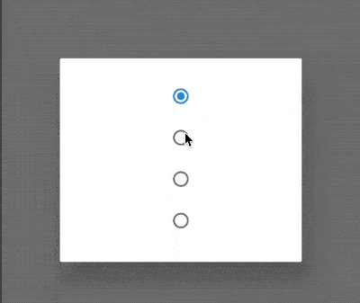

# StatefulBuilder

StatefulBuilder提供了局部更新控件的方法，当`StatefulWidget`中控件树较大时，更新一个属性导致整个树重建，消耗性能，而使用`StatefulBuilder`能有效的提高性能。

使用场景：弹出一个对话框，当这个对话框有状态变化时，使用`StatefulBuilder`控件

```dart
showDialog<void>(
  context: context,
  builder: (BuildContext context) {
    int selectedRadio = 0;
    return AlertDialog(
      content: StatefulBuilder(
        builder: (BuildContext context, StateSetter setState) {
          return Column(
            mainAxisSize: MainAxisSize.min,
            children: List<Widget>.generate(4, (int index) {
              return Radio<int>(
                value: index,
                groupValue: selectedRadio,
                onChanged: (int value) {
                  setState(() => selectedRadio = value);
                },
              );
            }),
          );
        },
      ),
    );
  },
);
```



