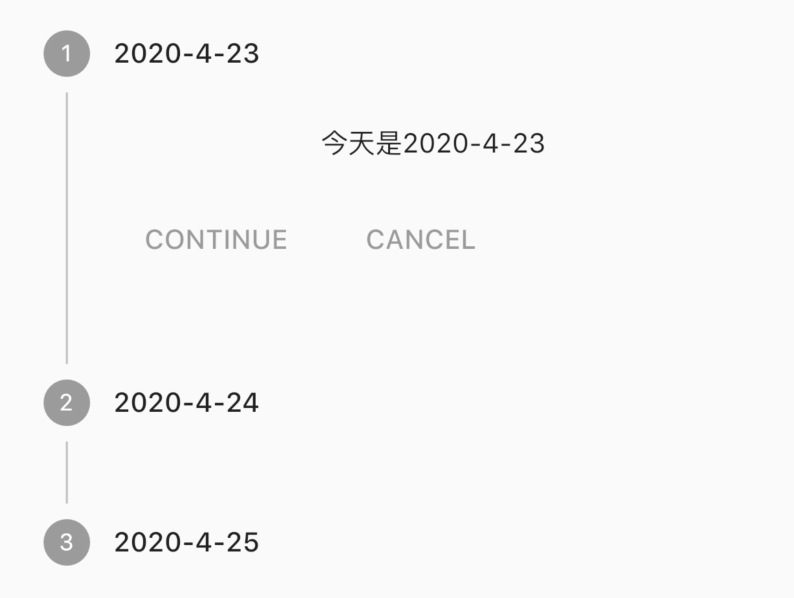
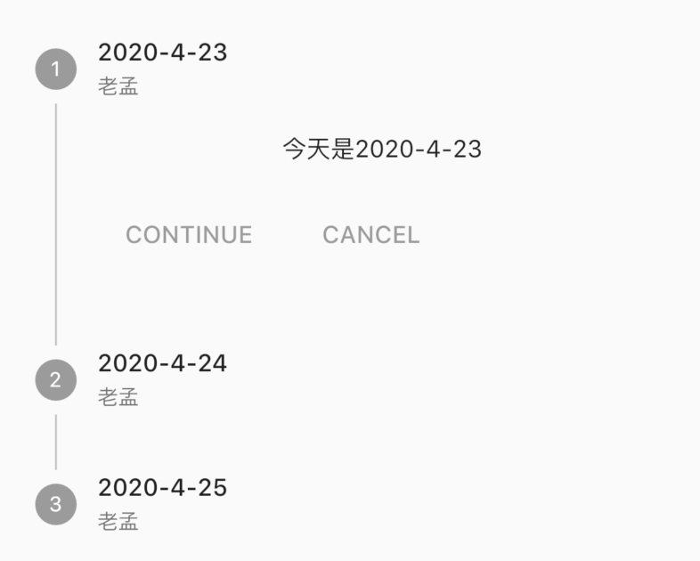
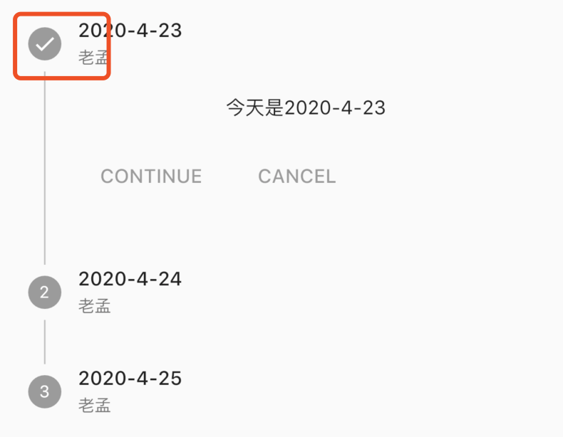
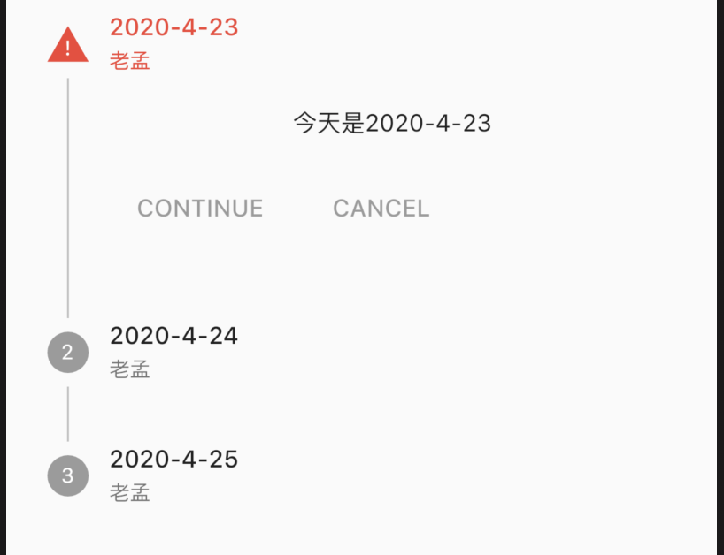
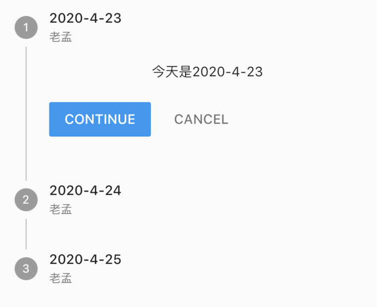
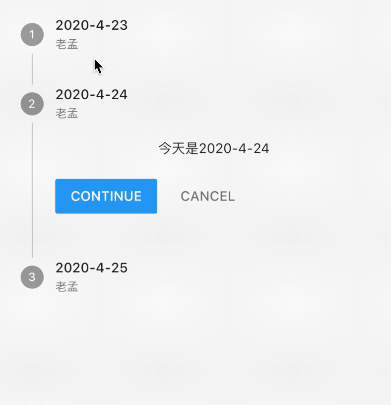
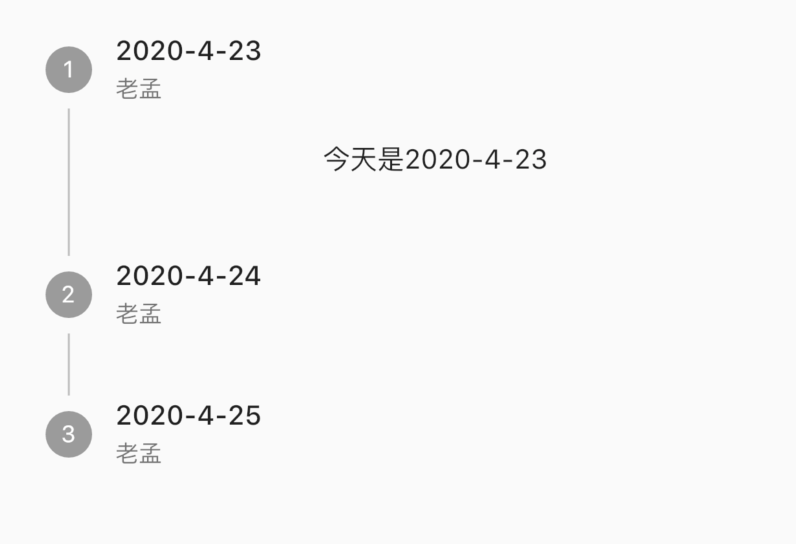
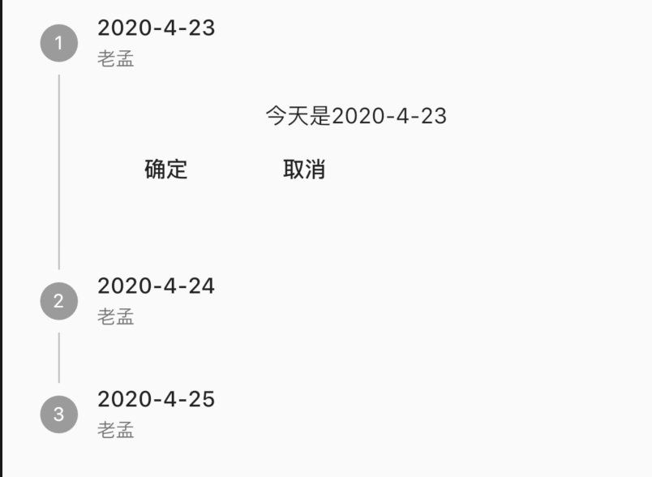

## Stepper

Stepper控件是一个展示一系列步骤进度的控件，用法如下：

```dart
Stepper(
  steps: <Step>[
    Step(
      title: Text('2020-4-23'),
      content: Text('今天是2020-4-23')
    ),
    Step(
        title: Text('2020-4-24'),
        content: Text('今天是2020-4-24')
    ),
    Step(
        title: Text('2020-4-25'),
        content: Text('今天是2020-4-25')
    ),
  ],
)
```

效果如下：



`Step`还可以设置`subtitle`属性，用法如下：

```dart
Step(
  title: Text('2020-4-23'),
  subtitle: Text('老孟'),
  content: Text('今天是2020-4-23')
)
```

效果如下：



`state`参数可以设置为StepState.complete、StepState.indexed等，其余参数可以参考StepState类，用法如下：

```dart
Step(
  title: Text('2020-4-23'),
  subtitle: Text('老孟'),
  content: Text('今天是2020-4-23'),
  state: StepState.complete
)
```

影响字体样式和圆圈内图标：



设置为`StepState.error`的效果：



点击事件：

```dart
Stepper(
  onStepCancel: (){
    print('onStepCancel');
  },
  onStepContinue: (){
    print('onStepContinue');
  },
  onStepTapped: (index){
    print('onStepTapped:$index');
  },
  ...
)
```

`onStepCancel`：点击`CANCEL`回调。

`onStepContinue`：点击`CONTINUE`回调。

`onStepTapped`：点击Step时回调。

效果如下：



切换显示的Step，设置如下：

```dart
int _currentStep = 0;
Stepper(
      onStepTapped: (index) {
        setState(() {
          _currentStep = index;
        });
      },
      currentStep: _currentStep,
      ...
)
```

效果如下：



我们最关心的是每一个Step下面的2个按钮如何去掉呢？可以使用`controlsBuilder`，用法如下：

```dart
Stepper(
  controlsBuilder: (BuildContext context, {VoidCallback onStepContinue, VoidCallback onStepCancel}){
    return Row(
      children: <Widget>[],
    );
  },
  ...
)
```

效果如下：



修改下面的2个按钮：

```dart
Stepper(
  controlsBuilder: (BuildContext context, {VoidCallback onStepContinue, VoidCallback onStepCancel}){
    return Row(
      children: <Widget>[
        RaisedButton(
          child: Text('确定'),
          onPressed: onStepContinue,
        ),
        RaisedButton(
          child: Text('取消'),
          onPressed: onStepCancel,
        ),
      ],
    );
  },
  ...
)
```

效果如下：

```dart
Stepper(
  controlsBuilder: (BuildContext context, {VoidCallback onStepContinue, VoidCallback onStepCancel}){
    return Row(
      children: <Widget>[
        FlatButton(
          child: Text('确定'),
          onPressed: onStepContinue,
        ),
        FlatButton(
          child: Text('取消'),
          onPressed: onStepCancel,
        ),
      ],
    );
  },
  onStepTapped: (index) {
    setState(() {
      _currentStep = index;
    });
  },
  onStepContinue: (){},
  onStepCancel: (){},
  ...
)
```

效果如下：



