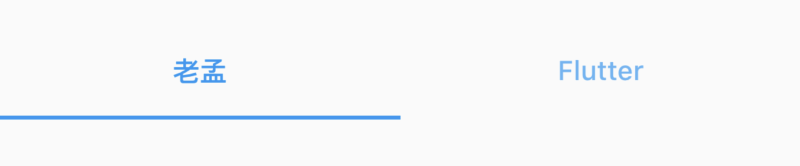
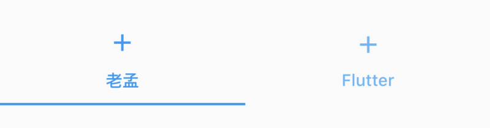
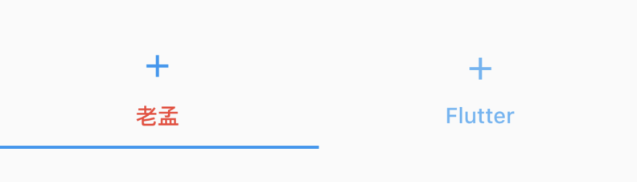

# Tab

Material 风格 tab，用于TabBar的tab。Tab可以单独作为一个控件使用，但通常情况下作为TabBar的tabs，用法如下：

```dart
TabBar(
  controller: _tabController,
  labelColor: Colors.blue,
  tabs: <Widget>[
    Tab(
      text: '老孟',
    ),
    Tab(
      text: 'Flutter',
    ),
  ],
)
```

效果如下：




设置图标：

```dart
Tab(
  text: '老孟',
  icon: Icon(Icons.add),
),
```

图标和text是上下布局，icon位于上部，效果如下：



设置`child`属性，`child`和`text`不能同时设置，`child`通常设置为Text控件，用法如下：

```dart
Tab(
  child: Text('老孟',style: TextStyle(color: Colors.red),),
  icon: Icon(Icons.add),
)
```

效果如下：



