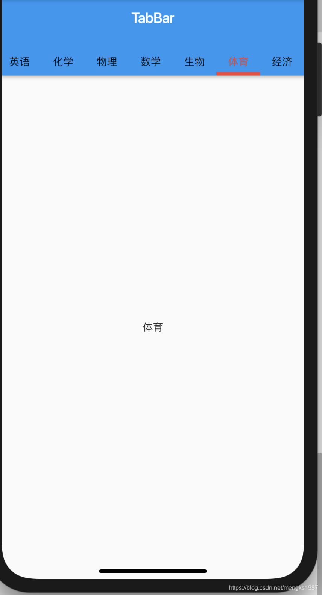

# TabBar

TabBar 是一排水平的标签，可以来回切换，效果图：


|属性|说明  |
|--|--|
| tabs | 一系列标签控件 |
|controller  | 标签选择变化控制器 |
| isScrollable | 是否可滚动，默认false |
| indicatorColor | 指示器颜色 |
|indicatorWeight  | 指示器粗细 |
| indicator |  指示器，可自定义形状等样式|
| indicatorSize | 指示器长短，tab：和tab一样长，label：和标签label 一样长|
| labelColor |标签颜色  |
| labelStyle |  标签样式|
| labelPadding | 标签padding |
| unselectedLabelColor | 未选中标签颜色 |
| unselectedLabelStyle | 未选中标签样式 |

## TabBarView

TabBar 一般情况下和TabBarView一起使用，TabBarView用于选择不同的TabBar，TabBarView显示对应的View
TabBarView属性说明：

|  |  |
|--|--|
| children | 一系列子控件，如果和TabBar一起使用注意和TabBar的长度一样 |
| controller | 控制器，如果和TabBar一起使用注意和TabBar使用同一个controller |

使用：

```
import 'package:flutter/material.dart';

class TabBarDemo extends StatefulWidget {
  @override
  State<StatefulWidget> createState() => _TabBar();
}

class _TabBar extends State<TabBarDemo> {
  final List<String> _tabValues = [
    '语文',
    '英语',
    '化学',
    '物理',
    '数学',
    '生物',
    '体育',
    '经济',
  ];

  TabController _controller;

  @override
  void initState() {
    super.initState();
    _controller = TabController(
      length: _tabValues.length,
      vsync: ScrollableState(),
    );
  }

  @override
  Widget build(BuildContext context) {
    // TODO: implement build
    return Scaffold(
      appBar: AppBar(
        title: Text('TabBar'),
        bottom: TabBar(
          tabs: _tabValues.map((f) {
            return Text(f);
          }).toList(),
          controller: _controller,
          indicatorColor: Colors.red,
          indicatorSize: TabBarIndicatorSize.tab,
          isScrollable: true,
          labelColor: Colors.red,
          unselectedLabelColor: Colors.black,
          indicatorWeight: 5.0,
          labelStyle: TextStyle(height: 2),
        ),
      ),
      body: TabBarView(
        controller: _controller,
        children: _tabValues.map((f) {
          return Center(
            child: Text(f),
          );
        }).toList(),
      ),
    );
  }
}

```
效果：



