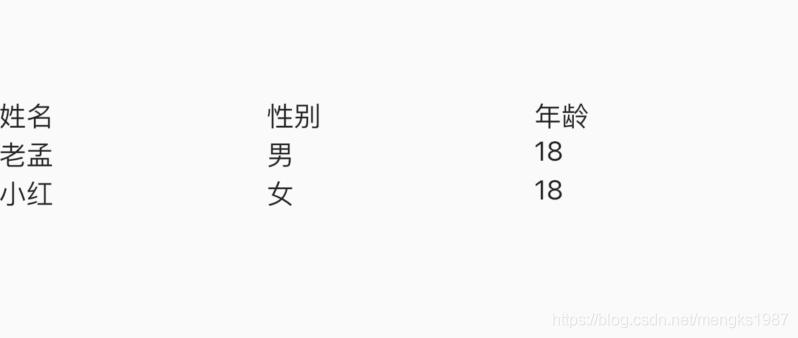
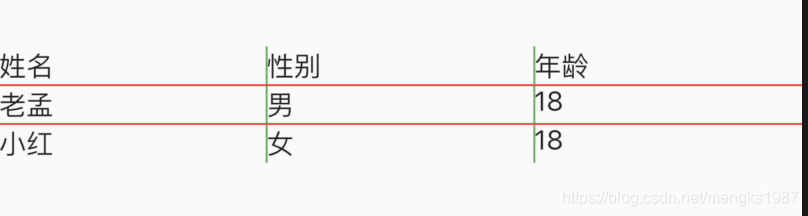
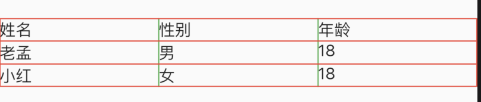
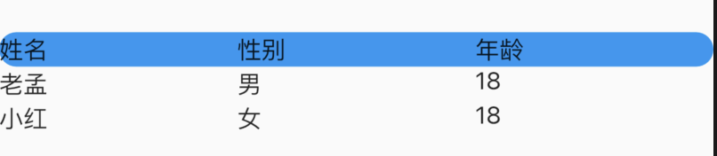

# Table

Table组件是一个表格组件，适合不滑动的网格控件，尤其是如果拥有不同大小的小控件。嵌套的行和列可能会比较乱，但Table组件组件提供了一致性并为您调整子窗口的大小。

## Table

基本用法：

```dart
Table(
  children: [
    TableRow(
      children: [
        TableCell(child: Text('姓名')),
        TableCell(child: Text('性别')),
        TableCell(child: Text('年龄')),
      ]
    ),
    TableRow(
        children: [
          TableCell(child: Text('老孟')),
          TableCell(child: Text('男')),
          TableCell(child: Text('18')),
        ]
    ),
    TableRow(
        children: [
          TableCell(child: Text('小红')),
          TableCell(child: Text('女')),
          TableCell(child: Text('18')),
        ]
    ),
  ],
)
```

效果如下：



给表格添加边框：

```dart
Table(
  border: TableBorder(
    horizontalInside: BorderSide(color: Colors.red),
    verticalInside: BorderSide(color: Colors.green),
  )
  ...
)
```

效果如下：



只有表格内部有边框，给四周也加上边框：

```dart
Table(
  border: TableBorder(
    top: BorderSide(color: Colors.red),
    left: BorderSide(color: Colors.red),
    right: BorderSide(color: Colors.red),
    bottom: BorderSide(color: Colors.red),
    horizontalInside: BorderSide(color: Colors.red),
    verticalInside: BorderSide(color: Colors.green),
  )
    ...
)
```

效果如下：



列宽默认是平分的，也可以设置为固定的宽度，代码如下：

```dart
Table(
  defaultColumnWidth: FixedColumnWidth(100),
      ...
)
```


## TableRow

TableRow表示表格的行，TableRow有多个TableCell，基本用法如下：

```dart
TableRow(children: [
  TableCell(child: Text('姓名')),
  TableCell(child: Text('性别')),
  ...
]),
```

设置TableRow的装饰，用法如下：

```dart
TableRow(
    decoration: ShapeDecoration(
        shape: RoundedRectangleBorder(
            borderRadius: BorderRadius.circular(30)),
        color: Colors.blue),
    children: [
      TableCell(child: Text('姓名')),
      TableCell(child: Text('性别')),
      TableCell(child: Text('年龄')),
    ]),
```

效果如下：




## TableCell

TableCell表示每一个网格内的控件，用法如下：

```dart
TableCell(child: Text('年龄')),
```

设置其垂直方向的对齐方式：

```
TableCell(
  child: Text('老孟'),
  verticalAlignment: TableCellVerticalAlignment.middle,
),
```


