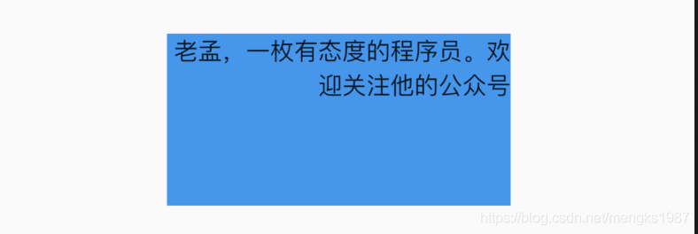
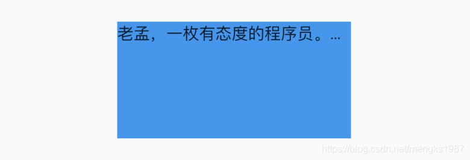

# Text

Text是显示文本的组件，最常用的组件，都没有之一。基本用法如下：

```dart
Text('老孟，一枚有态度的程序员')
```

一般情况下App的最外层都是Scaffold组件包裹，因此Text有默认的样式，如果Text组件的父组件没有Scaffold，需要设置样式。

### style

style是文本的样式，可以设置颜色、字体、大小、背景颜色等等，具体参考`TextStyle`。基本用法如下：

```dart
Text(
  '老孟，一枚有态度的程序员。欢迎关注他的公众号',
  style: TextStyle(color: Colors.red,fontSize: 16,fontWeight: FontWeight.bold),
)
```

### textAlign

`textAlign`参数是文本的对齐方式，用法参考【TextAlign】

### textDirection

textDirection是指文本的方向，有`TextDirection.ltr`从左到右和`TextDirection.rtl`从右到左，阿拉伯等国家的文字就是从右到左，用法如下：

```dart
Text(
  '老孟，一枚有态度的程序员。欢迎关注他的公众号',
  textDirection: TextDirection.rtl,
)
```

效果如下：



### softWrap和overflow

softWrap表示是否自动换行，用法如下：

```dart
Text(
  '老孟，一枚有态度的程序员。欢迎关注他的公众号',
  softWrap: true,
)
```

设置为false时，显示不全的文本将会按照`overflow`的设置的方式显示，比如以省略号结尾，用法如下：

```dart
Text(
  '老孟，一枚有态度的程序员。欢迎关注他的公众号',
  softWrap: false,
  overflow: TextOverflow.ellipsis,
)
```

效果如下：



溢出的处理方式说明：

- clip：直接裁剪。
- fade：越来越透明。
- ellipsis：省略号结尾。
- visible：依然显示，此时将会溢出父组件。


### textScaleFactor

textScaleFactor是文字缩放系数，用法如下：

```dart
Text(
  '老孟，一枚有态度的程序员。欢迎关注他的公众号',
  textScaleFactor: 1.5,
)
```

1.5表示比原来的字大50%，效果如下：


