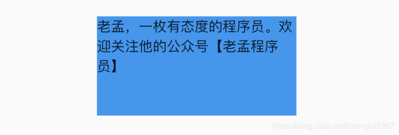

# TextAlign

TextAlign设置文本的对齐方式，用法如下：

```dart
Container(
  height: 100,
  width: 200,
  color:Colors.blue,
  child: Text(
    '老孟，一枚有态度的程序员。欢迎关注他的公众号【老孟程序员】',
    textAlign: TextAlign.start,
  ),
)
```

要给Text设置宽高的显示，当文本不满一行时，对齐方式的效果就体现出来了，下图是`start`的效果：



对齐方式说明如下：

- left：对齐父组件的左边。
- right：对齐父组件的右边。
- center：中间对齐。
- justify：拉伸“软换行”对齐父组件，而“硬换行”的文本依然对齐开始边。如果一行文本写到最后还剩2个单位，而下一个字需要4个单位，那么此时这个字不会分开写，而是直接换行，那么上面的可以称为“软换行”，“软换行”导致文本边缘有空隙，对齐方式设置justify时将会拉伸此行，字与字的间隔变大。“软换行”就是正好换行，没有空隙或者不满一行的文本。
- start：对齐父组件的开始边，开始边取决于TextDirection，如果是TextDirection.ltr，开始边是左边，如果是TextDirection.rtl，开始边是右边，
- end：对齐父组件的结束边，同start一样，结束边取决于TextDirection。