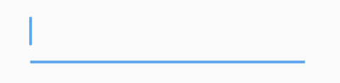
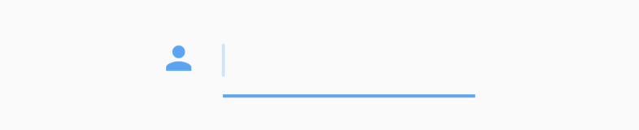
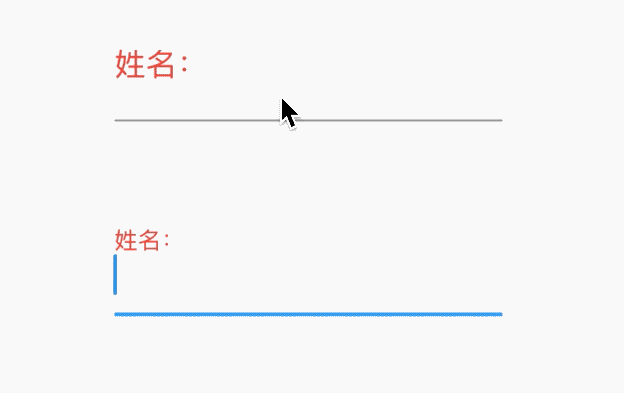
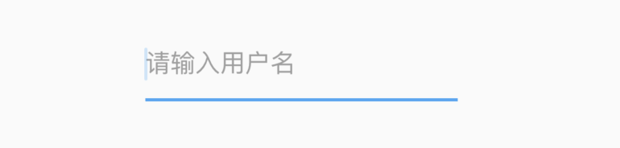
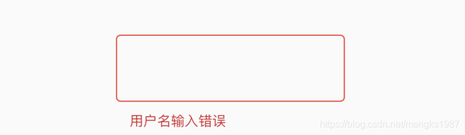
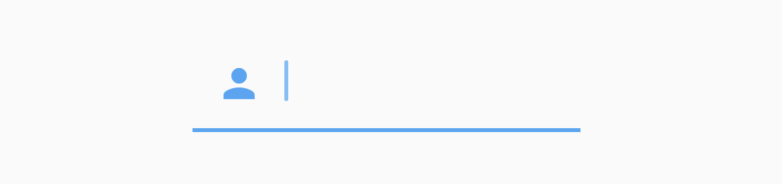
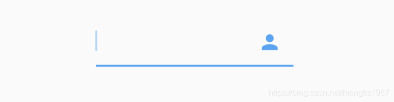
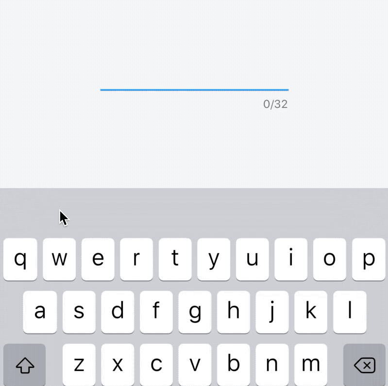
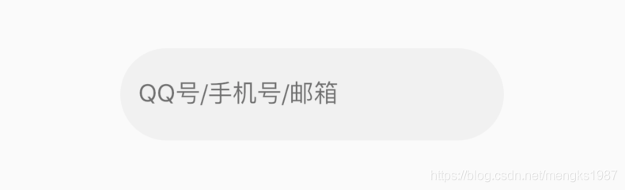
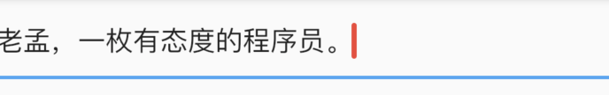

# TextField

## EditableText

EditableText是一个基本的文本输入组件，此组件和`TextInput`一起让用户编辑输入框的内容，提供滚动、选择、光标运动，但不提供焦点管理。通常情况下我们不会直至使用此组件，而是使用Material风格的TextField组件。

## TextInput

TextInput并不是组件，而是Flutter与原生交互的服务，控制键盘的显示。TextField组件的`TextInputAction`属性通过此服务实现。

## TextField

TextField是文本输入组件，即输入框，常用组件之一。基本用法：

```dart
TextField()
```

不需要任何参数，一个最简单的文本输入组件就出来了，效果如下：



### decoration

`decoration`是TextField组件的装饰（外观）参数，类型是InputDecoration。

#### icon

显示在输入框的前面，用法如下：

```dart
TextField(
  decoration: InputDecoration(
    icon: Icon(Icons.person),
  ),
)
```

效果如下：



####  labelText labelStyle hasFloatingPlaceholder

 当输入框是空而且没有焦点时，labelText显示在输入框上边，当获取焦点或者不为空时labelText往上移动一点，`labelStyle`参数表示文本样式，具体参考`TextStyle`， 用法如下：

```dart
TextField(
  decoration: InputDecoration(
    labelText: '姓名：',
    labelStyle: TextStyle(color:Colors.red)
  ),
)
```

效果如下：



`hasFloatingPlaceholder`参数控制当输入框获取焦点或者不为空时是否还显示`labelText`，默认为true，显示。

#### helperText helperStyle helperMaxLines

helperText显示在输入框的左下部，用于提示用户，`helperStyle`参数表示文本样式，具体参考`TextStyle`用法如下：

```dart
TextField(
  decoration: InputDecoration(
    helperText: '用户名长度为6-10个字母',
    helperStyle: TextStyle(color: Colors.blue),
    helperMaxLines: 1
  ),
)
```

效果如下：


#### hintText hintStyle hintMaxLines

hintText是当输入框为空时的提示，不为空时不在显示，用法如下：

```dart
TextField(
  decoration: InputDecoration(
    hintText: '请输入用户名',
    hintStyle: TextStyle(color: Colors.grey),
    hintMaxLines: 1
  ),
)
```



#### errorText errorStyle errorMaxLines errorBorder

errorText显示在输入框的左下部，默认字体为红色，用法如下：

```dart
TextField(
  decoration: InputDecoration(
    errorText: '用户名输入错误',
    errorStyle: TextStyle(fontSize: 12),
    errorMaxLines: 1,
    errorBorder: OutlineInputBorder(borderSide: BorderSide(color: Colors.red)),
  ),
)
```

效果如下：




#### prefixIcon prefix prefixText prefixStyle 

prefix系列的组件是输入框前面的部分，用法如下：

```dart
TextField(
  decoration: InputDecoration(
    prefixIcon: Icon(Icons.person)
  ),
)
```

注意prefix和icon的区别，icon是在输入框边框的外部，而prefix在里面，效果如下：



#### suffix suffixIcon suffixText suffixStyle

suffix和prefix相反，suffix在输入框的尾部，用法如下：

```dart
TextField(
  decoration: InputDecoration(
      suffixIcon: Icon(Icons.person)
  ),
)
```

效果：




#### counter counterText counterStyle

counter组件统计输入框文字的个数，counter仅仅是展示效果，不具备自动统计字数的功能， 自动统计字数代码如下：

```dart
var _textFieldValue = '';
TextField(
  onChanged: (value){
    setState(() {
      _textFieldValue = value;
    });
  },
  decoration: InputDecoration(
    counterText: '${_textFieldValue.length}/32'
  ),
)
```


效果如下：




#### filled fillColor focusedBorder disabledBorder

`filled`为true时，输入框将会被`fillColor`填充，仿QQ登录输入框代码如下：

```dart
Container(
  height: 60,
  width: 250,
  child: TextField(
    decoration: InputDecoration(
      fillColor: Color(0x30cccccc),
      filled: true,
      enabledBorder: OutlineInputBorder(
          borderSide: BorderSide(color: Color(0x00FF0000)),
          borderRadius: BorderRadius.all(Radius.circular(100))),
      hintText: 'QQ号/手机号/邮箱',
      focusedBorder: OutlineInputBorder(
          borderSide: BorderSide(color: Color(0x00000000)),
          borderRadius: BorderRadius.all(Radius.circular(100))),
    ),
  ),
)
```

效果如下：




#### isDense contentPadding

- isDense：设置为true则输入框的文本垂直方向空隙更小。
- contentPadding：内边距。


### controller

controller是输入框文本编辑的控制器，可以获取TextField的内容、设置TextField的内容，下面将输入的英文变为大写：

```dart
TextEditingController _controller;

@override
void initState() {
  super.initState();
  _controller = TextEditingController()
    ..addListener(() {
      //获取输入框的内容，变为大写
      _controller.text = _controller.text.toUpperCase();

    });
}

@override
Widget build(BuildContext context) {
  return TextField(
    controller: _controller,
  );
}

@override
dispose() {
  super.dispose();
  _controller.dispose();
}
```

有时输入框后面带有“清除”功能，需要controller来实现。如果需要2个TextField的内容进行同步，只需要给2个TextField设置同一个controller即可实现。


### keyboardType

`keyboardType`参数控制软键盘的类型，说明如下：

- text：通用键盘。
- multiline：当TextField为多行时（maxLines设置大于1），右下角的为“换行” 按键。
- number：数字键盘。
- phone：手机键盘，比数字键盘多"*"和 "#"。
- datetime：在ios上和text一样，在android上出现数字键盘、":"和 "-"。
- emailAddress：邮箱键盘，有"@" 和 "."按键。
- url：url键盘，有"/" 和 "."按键。
- visiblePassword：既有字幕又有数字的键盘。


### textInputAction

`textInputAction`参数控制软键盘右下角的按键，说明如下：

-  none：android上显示返回键，ios不支持。
-  unspecified：让操作系统自己决定哪个合适，一般情况下，android显示“完成”或者“返回”。 
- done：android显示代表“完成”的按钮，ios显示“Done”（中文：完成）。
-  go：android显示表达用户去向目的地的图标，比如向右的箭头，ios显示“Go”（中文：前往）。
-  search：android显示表达搜索的按钮，ios显示"Search"（中文：搜索）。
-  send：android显示表达发送意思的按钮，比如“纸飞机”按钮，ios显示"Send"（中文：发送）。
-  next：android显示表达“前进”的按钮，比如“向右的箭头”,ios显示"Next"（中文：下一项）。
-  previous：android显示表达“后退”的按钮，比如“向左的箭头”,ios不支持。
-  continueAction：android 不支持，ios仅在ios9.0+显示"Continue"（中文：继续）。
-  join：Android和ios显示"Join"（中文：加入）。
-  route：android 不支持，ios显示"Route"（中文：路线）。
-  emergencyCall：android 不支持，ios显示"Emergency Call"（中文：紧急电话）。
-  newline：android显示表达“换行”的按钮，ios显示”换行“。

大家可能发现了，Android上显示的按钮大部分是不确定的，比如`next`有的显示向右的箭头，有的显示前进，这是因为各大厂商对Android ROM定制引发的。

### textCapitalization

`textCapitalization`参数是配置键盘是大写还是小写，仅支持键盘模式为`text`，其他模式下忽略此配置，说明如下：

-  words：每一个单词的首字母大写。
-  sentences：每一句话的首字母大写。
-  characters：每个字母都大写
-  none：都小写

这里仅仅是控制软键盘是大写模式还是小写模式，你也可以切换大小写，系统并不会改变输入框内的内容。

### textAlign textAlignVertical textDirection

`textAlign`表示文本的对齐方式，用法参考【TextAlign】。

`textAlignVertical`表示垂直方向的对齐方式，`textDirection`表示文本方向，用法如下：

```dart
TextField(
  textAlignVertical: TextAlignVertical.center,
  textDirection: TextDirection.rtl,
)
```

### toolbarOptions

`toolbarOptions`表示长按时弹出的菜单，有`copy`、`cut`、`paste`、`selectAll`，用法如下：

```dart
TextField(
  toolbarOptions: ToolbarOptions(
    copy: true,
    cut: true,
    paste: true,
    selectAll: true
  ),
)
```

  ### showCursor cursorWidth cursorRadius cursorColor

`cursor`表示光标，用法如下：

```dart
TextField(
  showCursor: true,
  cursorWidth: 3,
  cursorRadius: Radius.circular(10),
  cursorColor: Colors.red,
)
```

效果如下：



### 密码输入框

将输入框设置为密码框，只需`obscureText`属性设置true即可，用法如下：

```dart
TextField(
  obscureText: true,
)
```

### 输入格式匹配

通过`inputFormatters`可以限制用户输入的内容，比如只想让用户输入字符，设置如下：

```dart
TextField(
  inputFormatters: [
    WhitelistingTextInputFormatter(RegExp("[a-zA-Z]")),
  ],
)
```

这时用户是无法输入数字的。

### onChanged  onSubmitted onTap

`onChanged`是当内容发生变化时回调，`onSubmitted`是点击回车或者点击软键盘上的完成回调，`onTap`点击输入框时回调，用法如下：

```dart
TextField(
  onChanged: (value){
    print('onChanged:$value');
  },
  onEditingComplete: (){
    print('onEditingComplete');
  },
  
  onTap: (){
    print('onTap');
  },
)
```

### 字数统计

输入框右下角经常需要字数统计，除了使用上面介绍的方法外，还可以使用`buildCounter`，建议使用此方法，用法如下：

```dart
TextField(
  maxLength: 100,
  buildCounter: (
    BuildContext context, {
    int currentLength,
    int maxLength,
    bool isFocused,
  }) {
    return Text(
      '$currentLength/$maxLength',
    );
  },
)
```


## 动态获取焦点

```dart
FocusScope.of(context).requestFocus(_focusNode);
```

`_focusNode`为TextField的focusNode：

```dart
_focusNode = FocusNode();

TextField(
	focusNode: _focusNode,
	...
)
```


## 动态失去焦点

```dart
_focusNode.unfocus();
```


## CupertinoTextField

CupertinoTextField和TextField基本一样，TextField是基于Material风格的，而CupertinoTextField是ios风格的输入框。ios风格默认效果如下：


