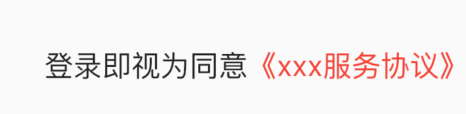

## TextSpan

文本片段，html里有个span这里有个TextSpan，作用基本相同，文字放一行，text与children任选一样填写。

TextSpan与RichText配合使用可以实现不同样式文字布局。

```
TextSpan({
    this.text,
    this.children,//是一个TextSpan的数组，也就是说TextSpan可以包括其他TextSpan
    TextStyle style,
    this.recognizer,//它是点击链接后的一个处理器,用于对该文本片段上用于手势进行识别处理,设定手势识别器
    this.semanticsLabel,
})
```


案例：

```dart
RichText(
  text: TextSpan(
      style: DefaultTextStyle.of(context).style,
      children: <InlineSpan>[
        TextSpan(text: '登录即视为同意'),
        TextSpan(
          text: '《xxx服务协议》',
          style: TextStyle(color: Colors.red),
        ),
      ]),
)
```



还可以给一部分文字添加点击效果：

```dart
TextSpan(
  text: '《xxx服务协议》',
  style: TextStyle(color: Colors.red),
  recognizer: TapGestureRecognizer()..onTap = () {},
),
```


本文由[**Rock**]()提供。