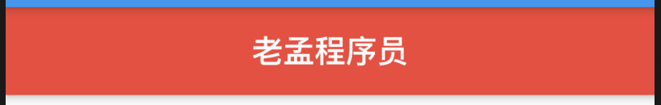
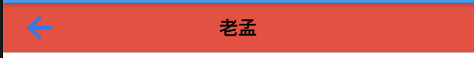

## Theme

Theme是一个将主题应用于子组件的组件，用法如下：

```dart
Theme(
  data: ThemeData(
    primaryColor: Colors.red,
  ),
  child: Scaffold(
    appBar: AppBar(
      title: Text('老孟程序员'),
    ),
  ),
)
```

效果如下：



Theme下有很多主题可以设置：

```
ThemeData({
  Brightness brightness, //深色还是浅色
  MaterialColor primarySwatch, //主题颜色样本，见下面介绍
  Color primaryColor, //主色，决定导航栏颜色
  Color accentColor, //次级色，决定大多数Widget的颜色，如进度条、开关等。
  Color cardColor, //卡片颜色
  Color dividerColor, //分割线颜色
  ButtonThemeData buttonTheme, //按钮主题
  Color cursorColor, //输入框光标颜色
  Color dialogBackgroundColor,//对话框背景颜色
  String fontFamily, //文字字体
  TextTheme textTheme,// 字体主题，包括标题、body等文字样式
  IconThemeData iconTheme, // Icon的默认样式
  TargetPlatform platform, //指定平台，应用特定平台控件风格
  ...
})
```


还有很多主题，可以查看`ThemeData`类，通过名称基本就明白其表示的意思了。


## CupertinoTheme

CupertinoThemeData组件是将主题应用于IOS风格的子组件，用法如下：

```dart
CupertinoTheme(
  data: CupertinoThemeData(
    barBackgroundColor: Colors.red,
  ),
  child: CupertinoPageScaffold(
    navigationBar: CupertinoNavigationBar(
      leading: Icon(Icons.arrow_back),
      middle: Text('老孟'),
    ),
    child: Container(),
  ),
)
```

效果如下：



CupertinoThemeData主题包括：

```
const CupertinoThemeData({
  Brightness brightness, //深色还是浅色
  Color primaryColor, //主色，决定导航栏颜色
  Color primaryContrastingColor, //在[primaryColor]背景上呈现时必须易于查看的颜色。
  CupertinoTextThemeData textTheme, // 字体主题
  Color barBackgroundColor, //导航背景颜色
  Color scaffoldBackgroundColor, //整体布局背景颜色
})
```