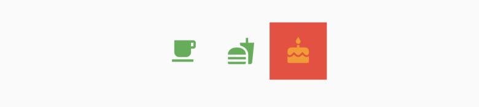
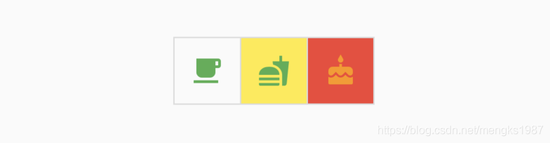

# ToggleButtons

ToggleButtons组件将多个组件组合在一起，并让用户从中选择，ToggleButtons基础用法如下：

```dart
List<bool> _selecteds = [false, false, true];
ToggleButtons(
      isSelected: _selecteds,
      children: <Widget>[
        Icon(Icons.local_cafe),
        Icon(Icons.fastfood),
        Icon(Icons.cake),
      ],
      onPressed: (index) {
        setState(() {
          _selecteds[index] = !_selecteds[index];
        });
      },
    );
```

`isSelected` 属性是bool类型集合，数量和children的数量一致，`onPressed`是点击回调，这时就有了不错了切换按钮行，效果如下：


我们还可以自定义外观，比如设置按钮的颜色：

```dart
ToggleButtons(
      color: Colors.green,
      selectedColor: Colors.orange,
  		fillColor: Colors.red,
      ...
)
```

效果如下：


`fillColor`是选中按钮的背景颜色。

如果不需要边框，可以将`renderBorder`设置为false：

```dart
ToggleButtons(
	renderBorder: false,
)
```

效果如下：



当然我们也可以设置边框的圆角半径、宽度、颜色等：

```dart
ToggleButtons(
      borderRadius: BorderRadius.circular(30),
      borderColor: Colors.orange,
      borderWidth: 3,
      selectedBorderColor: Colors.deepOrange,
）
```

效果如下：


甚至可以设置点击水波纹颜色（splashColor）和按下时的高亮颜色（highlightColor）：

```
ToggleButtons(
      splashColor: Colors.purple,
      highlightColor: Colors.yellow,
      ）
```

效果如下：



如果按钮处于禁用状态，可以设置禁用状态下按钮及边框的颜色：

```dart
ToggleButtons(
      onPressed: null,
      disabledColor: Colors.grey[300],
      disabledBorderColor: Colors.blueGrey,
      )
```

效果如下：


如果开发的是web程序，我们可以设置鼠标悬停颜色：

```
ToggleButtons(
      hoverColor: Colors.cyan,
      )
```


