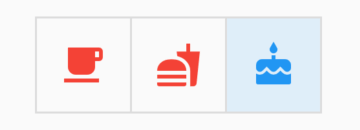

# ToggleButtonsTheme

用于**ToggleButtons**组件样式。

```dart
ToggleButtonsTheme(
  data: ToggleButtonsTheme.of(context).copyWith(
    color: Colors.red
  ),
  child: ToggleButtons(
    isSelected: _selecteds,
    children: <Widget>[
      Icon(Icons.local_cafe),
      Icon(Icons.fastfood),
      Icon(Icons.cake),
    ],
    onPressed: (index) {
      setState(() {
        _selecteds[index] = !_selecteds[index];
      });
    },
  ),
)
```



## ToggleButtonsThemeData

样式说明如下：

```dart
const ToggleButtonsThemeData({
  this.textStyle, //文本样式
  this.constraints,//定义button尺寸
  this.color,//文本和Icon的颜色
  this.selectedColor,//选中文本和Icon的颜色
  this.disabledColor,//禁用文本和Icon的颜色
  this.fillColor,//选中button填充颜色
  this.focusColor,//按钮具有输入焦点时用于填充按钮的颜色。
  this.highlightColor,//高亮颜色
  this.hoverColor,// 指针悬停在它上面时的颜色
  this.splashColor,// 水波纹颜色
  this.borderColor,//边框颜色
  this.selectedBorderColor,//选中边框颜色
  this.disabledBorderColor,//禁用边框颜色
  this.borderRadius,//边框半径
  this.borderWidth,//边框宽度
});
```

